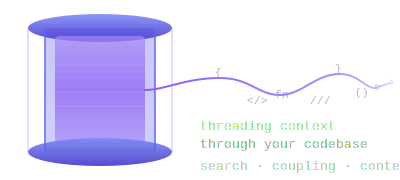

<p align="center">
  
</p>

<p align="center">
  
</p>

**Local-first code context engine.** Semantic search, keyword search, and git coupling analysis — all running on your machine. No API keys. No cloud. Sub-100ms queries.

> *Your codebase has structure, history, and meaning. Bobbin indexes all three.*

## See It In Action

```text
$ bobbin search "authentication middleware"
✓ Found 8 results for: authentication middleware (hybrid)

1. src/auth/middleware.rs:14 (verify_token)
   function rust · lines 14-47 · score 0.8923 [hybrid]

2. src/auth/session.rs:88 (create_session)
   function rust · lines 88-121 · score 0.8541 [semantic]

3. src/handlers/login.rs:31 (handle_login)
   function rust · lines 31-62 · score 0.7892 [keyword]
```

```text
$ bobbin context "fix the login bug"
✓ Context for: fix the login bug
  6 files, 14 chunks (487/500 lines)

--- src/auth/middleware.rs [direct, score: 0.8923] ---
  verify_token (function), lines 14-47
--- src/handlers/login.rs [direct, score: 0.7892] ---
  handle_login (function), lines 31-62
--- src/auth/session.rs [coupled via src/auth/middleware.rs] ---
  create_session (function), lines 88-121
```

```text
$ bobbin related src/auth/middleware.rs
Related to src/auth/middleware.rs:
1. src/auth/session.rs (score: 0.85) - Co-changed 23 times
2. src/handlers/login.rs (score: 0.72) - Co-changed 18 times
3. tests/auth_test.rs (score: 0.68) - Co-changed 15 times
```

## Why Bobbin?

|  | **ripgrep** | **Sourcegraph** | **Bobbin** |
|--|:-----------:|:---------------:|:----------:|
| Keyword search          | ✅ | ✅ | ✅ |
| Semantic search         | ❌ | ✅ | ✅ |
| Git coupling analysis   | ❌ | ❌ | ✅ |
| Task-aware context      | ❌ | ❌ | ✅ |
| MCP server (AI agents)  | ❌ | ❌ | ✅ |
| Runs 100% locally       | ✅ | ❌ | ✅ |
| No API keys required    | ✅ | ❌ | ✅ |
| Sub-100ms queries       | ✅ | ❌ | ✅ |

## Features

🔍 **Hybrid Search** — Semantic + keyword results fused via [Reciprocal Rank Fusion](https://plg.uwaterloo.ca/~gvcormac/cormacksigir09-rrf.pdf). Ask in natural language or grep by pattern.

🌳 **Structure-Aware Parsing** — Tree-sitter extracts functions, classes, structs, traits, and more from 7 languages. Markdown parsed into sections, tables, and code blocks.

🔗 **Git Temporal Coupling** — Analyzes commit history to find files that change together. `bobbin related src/auth.rs` reveals hidden dependencies no import graph can see.

📦 **Task-Aware Context** — `bobbin context "fix the login bug"` builds a budget-controlled bundle from search results + coupled files. Feed it straight to an AI agent.

🤖 **MCP Server** — `bobbin serve` exposes 12 tools to Claude Code, Cursor, and any MCP-compatible agent.

🌐 **Multi-Repo** — Index multiple repositories into one database. Search across all or filter by name.

⚡ **Fast & Private** — ONNX embeddings (all-MiniLM-L6-v2), LanceDB vector storage, SQLite for coupling. Everything on your machine.

🚀 **GPU Accelerated** — Automatic CUDA detection for 10-25x faster indexing on NVIDIA GPUs. Index 57K chunks in under 5 minutes. Falls back to CPU seamlessly.

🪝 **Claude Code Hooks** — Automatic context injection on every prompt via `UserPromptSubmit` hook. Session primer via `SessionStart` hook. Smart gating skips injection when context is irrelevant.

## Quick Start

**1. Install**

```bash
cargo install bobbin
```

**2. Index your codebase**

```bash
cd your-project
bobbin init && bobbin index
```

**3. Search**

```bash
bobbin search "error handling"         # Semantic + keyword hybrid
bobbin context "fix the login bug"     # Task-aware context bundle
bobbin related src/auth.rs             # Git coupling analysis
```

## GPU Acceleration

Bobbin automatically detects NVIDIA CUDA GPUs and accelerates embedding inference. No configuration needed — if a GPU is available, it's used.

| Metric | CPU | GPU (RTX 4070S) |
|--------|-----|-----------------|
| Embed throughput | ~100 chunks/s | ~2,400 chunks/s |
| Index ruff (57K chunks) | >30 min | ~4 min |

**Setup** (optional — CPU works out of the box):

```bash
# Install ONNX Runtime GPU (requires CUDA toolkit)
# See docs for full setup: https://scbrown.github.io/bobbin/config/gpu.html

# Force CPU even when GPU is available:
BOBBIN_GPU=0 bobbin index
```

## AI Agent Integration

Bobbin ships an MCP server that gives AI agents direct access to your codebase:

```bash
bobbin serve
```

Add to your Claude Code or Cursor MCP config:

```json
{
  "mcpServers": {
    "bobbin": {
      "command": "bobbin",
      "args": ["serve"]
    }
  }
}
```

Exposes 12 tools: `search`, `grep`, `context`, `related`, `find_refs`, `list_symbols`, `read_chunk`, `hotspots`, `impact`, `review`, `similar`, and `prime`.

### Claude Code Hooks

For automatic context injection without MCP, add hooks to `.claude/settings.json`:

```json
{
  "hooks": {
    "UserPromptSubmit": [{
      "hooks": [{
        "command": "bobbin hook inject-context",
        "timeout": 10,
        "type": "command"
      }]
    }],
    "SessionStart": [{
      "hooks": [{
        "command": "bobbin hook prime-context",
        "timeout": 5,
        "type": "command"
      }]
    }]
  }
}
```

The `inject-context` hook embeds your prompt, searches the index, and injects the most relevant code snippets. A relevance gate skips injection when the best match is too weak, and session dedup avoids re-injecting unchanged context.

## Supported Languages

| Language   | Parser        | Extracted Units |
|------------|---------------|-----------------|
| Rust       | Tree-sitter   | functions, impl blocks, structs, enums, traits, modules |
| TypeScript | Tree-sitter   | functions, methods, classes, interfaces |
| Python     | Tree-sitter   | functions, classes |
| Go         | Tree-sitter   | functions, methods, type declarations |
| Java       | Tree-sitter   | methods, constructors, classes, interfaces, enums |
| C++        | Tree-sitter   | functions, classes, structs, enums |
| Markdown   | pulldown-cmark| sections, tables, code blocks, YAML frontmatter |

Other file types use line-based chunking with overlap.

## Documentation

📚 **[The Bobbin Book](https://scbrown.github.io/bobbin/)** — Comprehensive guides, CLI reference, architecture, and more

- [Getting Started](https://scbrown.github.io/bobbin/getting-started/quick-start.html) — Installation and first index
- [CLI Reference](https://scbrown.github.io/bobbin/cli/overview.html) — All commands, flags, and examples
- [MCP Tools](https://scbrown.github.io/bobbin/mcp/overview.html) — AI agent integration reference
- [Configuration](https://scbrown.github.io/bobbin/config/reference.html) — `.bobbin/config.toml` reference
- [Architecture](https://scbrown.github.io/bobbin/architecture/overview.html) — System design, data flow, storage schema
- [Evaluation](https://scbrown.github.io/bobbin/eval/overview.html) — Methodology, results, and metrics
- [Contributing](CONTRIBUTING.md) — Build, test, and development setup

## License

[MIT](LICENSE)
