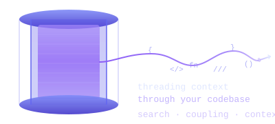

<p align="center">
  
</p>

<p align="center">
  
</p>

**Local-first code context engine.** Semantic search, keyword search, and git coupling analysis — all running on your machine. No API keys. No cloud. Sub-100ms queries.

> *Your codebase has structure, history, and meaning. Bobbin indexes all three.*

## See It In Action

```text
$ bobbin search "authentication middleware"
✓ Found 8 results for: authentication middleware (hybrid)

1. src/auth/middleware.rs:14 (verify_token)
   function rust · lines 14-47 · score 0.8923 [hybrid]

2. src/auth/session.rs:88 (create_session)
   function rust · lines 88-121 · score 0.8541 [semantic]

3. src/handlers/login.rs:31 (handle_login)
   function rust · lines 31-62 · score 0.7892 [keyword]
```

```text
$ bobbin context "fix the login bug"
✓ Context for: fix the login bug
  6 files, 14 chunks (487/500 lines)

--- src/auth/middleware.rs [direct, score: 0.8923] ---
  verify_token (function), lines 14-47
--- src/handlers/login.rs [direct, score: 0.7892] ---
  handle_login (function), lines 31-62
--- src/auth/session.rs [coupled via src/auth/middleware.rs] ---
  create_session (function), lines 88-121
```

```text
$ bobbin related src/auth/middleware.rs
Related to src/auth/middleware.rs:
1. src/auth/session.rs (score: 0.85) - Co-changed 23 times
2. src/handlers/login.rs (score: 0.72) - Co-changed 18 times
3. tests/auth_test.rs (score: 0.68) - Co-changed 15 times
```

## Why Bobbin?

|  | **ripgrep** | **Sourcegraph** | **Bobbin** |
|--|:-----------:|:---------------:|:----------:|
| Keyword search          | ✅ | ✅ | ✅ |
| Semantic search         | ❌ | ✅ | ✅ |
| Git coupling analysis   | ❌ | ❌ | ✅ |
| Task-aware context      | ❌ | ❌ | ✅ |
| MCP server (AI agents)  | ❌ | ❌ | ✅ |
| Knowledge graph          | ❌ | ❌ | ✅ |
| Runs 100% locally       | ✅ | ❌ | ✅ |
| No API keys required    | ✅ | ❌ | ✅ |
| Sub-100ms queries       | ✅ | ❌ | ✅ |

## Features

🔍 **Hybrid Search** — Semantic + keyword results fused via [Reciprocal Rank Fusion](https://plg.uwaterloo.ca/~gvcormac/cormacksigir09-rrf.pdf). Ask in natural language or grep by pattern.

🌳 **Structure-Aware Parsing** — Tree-sitter extracts functions, classes, structs, traits, and more from 6 languages (Rust, TypeScript, Python, Go, Java, C++). Markdown parsed into sections, tables, and code blocks; other languages use line-based chunking.

🔗 **Git Temporal Coupling** — Analyzes commit history to find files that change together. `bobbin related src/auth.rs` reveals hidden dependencies no import graph can see.

📦 **Task-Aware Context** — `bobbin context "fix the login bug"` builds a budget-controlled bundle from search results + coupled files. Feed it straight to an AI agent.

🤖 **MCP Server** — `bobbin serve` exposes 31 tools to Claude Code, Cursor, and any MCP-compatible agent (26 always available; the five `knowledge_*` tools require the `knowledge` build feature).

🧠 **Knowledge Graph (Quipu)** — Optional integration with [Quipu](https://github.com/scbrown/quipu) for structured knowledge alongside code. SPARQL queries, SHACL-validated writes, and vector search over knowledge entities — exposed as five `knowledge_*` MCP tools that query the remote ontology and the local code graph side by side. Feature-gated behind `knowledge`.

🔁 **Versioned Share Contract** — Knowledge builds carry typed Quipu share-manifest and import request/response contracts. Bobbin rejects unsupported manifest versions and non-canonical bundle paths, while preserving additive fields from compatible v1 producers. Runtime share/import tools will use Quipu's canonical interfaces rather than a Bobbin-specific bundle dialect.

🧵 **Governed Chunk Ontology** — Knowledge builds can publish each index run as a replaceable snapshot, so a reindex diffs rather than accumulates. A named code chunk or document section is published as a single node carrying both `bobbin:Chunk` and its governed code-entity type, under the same identity an external code-graph producer would mint for it, so the two graphs join instead of describing the same symbol twice. Anonymous spans keep their own chunk identity. Publication is opt-in via `quipu_push_chunks`; set `quipu_endpoint` for authenticated remote `/knot` delivery, or leave it unset and the snapshot lands in the embedded store.

🧪 **Quarantined Inferred Extraction** — A deterministic extractor mines candidate entities and relationships from markdown prose. Candidates are claims, not observations, and the distinction is structural: every fact carries its extractor and parameters as the derivation method, lands only in a quarantined trust-rank-0 plane via graph-routed writes (the push refuses stores that cannot route graphs strictly), and is served only inside a quarantine envelope. Promotion out of quarantine belongs to the governing ontology, never the writer. Opt-in via `quipu_push_inferred` or the `knowledge_inferred_extract` MCP tool.

🌐 **Multi-Repo** — Index multiple repositories into one database. Search across all or filter by name.

⚡ **Fast & Private** — ONNX embeddings (all-MiniLM-L6-v2), LanceDB vector storage, SQLite for coupling. Everything on your machine.

🚀 **GPU Accelerated** — Automatic CUDA detection for 10-25x faster indexing on NVIDIA GPUs. Index 57K chunks in under 5 minutes. Falls back to CPU seamlessly.

🪝 **Claude Code Hooks** — Automatic context injection on every prompt via `UserPromptSubmit` hook. Session primer via `SessionStart` hook. Reactive context via `PostToolUse` hook (inject related files when code is edited). Smart gating skips injection when context is irrelevant.

🔄 **Feedback Loop** — Agents rate injections as useful/noise/harmful. Lineage tracking ties feedback to fixes (commits, beads, config changes). Metrics close the loop between search quality and real-world impact.

🛡️ **FTS Churn Recovery** — Keyword and hybrid searches survive transient index churn: a failed full-text query triggers a bounded rebuild-and-retry cycle with backoff, and only a request that exhausts it surfaces an error — the original cause, not a synthesised one. `/metrics` exposes `bobbin_fts_rebuild_total` and mode-labelled `bobbin_search_errors_total{reason="fts"}` counters, so how often this happens is measurable rather than anecdotal. Indexing gets the same honesty: a Lance FTS compaction panic triggers a full index rebuild and one retried compaction, and a maintenance failure fails `bobbin index` instead of exiting 0.

## Quick Start

**1. Install**

```bash
cargo install bobbin
```

**2. Index your codebase**

```bash
cd your-project
bobbin init && bobbin index
```

**3. Search**

```bash
bobbin search "error handling"         # Semantic + keyword hybrid
bobbin context "fix the login bug"     # Task-aware context bundle
bobbin related src/auth.rs             # Git coupling analysis
```

## GPU Acceleration

Bobbin automatically detects NVIDIA CUDA GPUs and accelerates embedding inference. No configuration needed — if a GPU is available, it's used.

| Metric | CPU | GPU (RTX 4070S) |
|--------|-----|-----------------|
| Embed throughput | ~100 chunks/s | ~2,400 chunks/s |
| Index ruff (57K chunks) | >30 min | ~4 min |

**Setup** (optional — CPU works out of the box):

```bash
# Install ONNX Runtime GPU (requires CUDA toolkit)
# See docs for full setup: https://scbrown.github.io/bobbin/config/gpu.html

# Force CPU even when GPU is available:
BOBBIN_GPU=0 bobbin index
```

## AI Agent Integration

Bobbin ships an MCP server that gives AI agents direct access to your codebase:

```bash
bobbin serve
```

Add to your Claude Code or Cursor MCP config:

```json
{
  "mcpServers": {
    "bobbin": {
      "command": "bobbin",
      "args": ["serve"]
    }
  }
}
```

Exposes 31 tools including: `search`, `grep`, `context`, `related`, `find_refs`, `list_symbols`, `read_chunk`, `chunk_neighbors`, `hotspots`, `impact`, `review`, `similar`, `prime`, `search_beads`, `dependencies`, `file_history`, `test_coverage`, `status`, `commit_search`, `feedback_submit`, `feedback_list`, `feedback_stats`, `feedback_lineage_store`, `feedback_lineage_list`, `archive_search`, and `archive_recent`, plus `knowledge_context`, `knowledge_query`, `knowledge_knot`, `knowledge_reconcile_mentions`, and `knowledge_inferred_extract` (require the `knowledge` build feature).

For agents, prefer this interface order: use MCP tools when a Bobbin server is
available, use the equivalent `bobbin` CLI command next, and use the documented
HTTP API as a transport fallback. For example, the search fallback is
`GET /search?q=...`; it is not a JSON `POST` endpoint.

### Claude Code Hooks

For automatic context injection without MCP, run `bobbin hook install` (the source
of truth), which writes **four** hooks to `.claude/settings.json`:

```json
{
  "hooks": {
    "UserPromptSubmit": [{
      "hooks": [{
        "command": "bobbin hook inject-context || true",
        "timeout": 10,
        "type": "command"
      }]
    }],
    "SessionStart": [{
      "matcher": "compact",
      "hooks": [{
        "command": "bobbin hook session-context || true",
        "timeout": 10,
        "type": "command"
      }]
    }],
    "PostToolUse": [{
      "matcher": "Write|Edit|Bash|Grep|Glob|Read",
      "hooks": [{
        "command": "bobbin hook post-tool-use || true",
        "timeout": 10,
        "type": "command"
      }]
    }],
    "PostToolUseFailure": [{
      "hooks": [{
        "command": "bobbin hook post-tool-use-failure || true",
        "timeout": 10,
        "type": "command"
      }]
    }]
  }
}
```

The `inject-context` hook embeds your prompt, searches the index, and injects the
most relevant code snippets. A relevance gate skips injection when the best match
is too weak, and session dedup avoids re-injecting unchanged context. The
`SessionStart` hook restores context after compaction, and the reactive
`PostToolUse` / `PostToolUseFailure` hooks inject related files when code is
edited or a tool call fails.

## Architecture

```text
                    Agent / Claude Code
                           │
            ┌──────────────┼──────────────┐
            │              │              │
       ┌────┴────┐    ┌────┴────┐   ┌────┴────┐
       │ Bobbin  │    │ Unified │   │  Quipu  │
       │  Code   │    │ Context │   │Knowledge│
       │ Search  │    │ Pipeline│   │  Graph  │
       └────┬────┘    └────┬────┘   └────┬────┘
            │              │              │
       ┌────┴────┐         │         ┌────┴────┐
       │ LanceDB │         │         │ SQLite  │
       │ vectors │         │         │  EAVT   │
       │ + FTS   │         │         │+ vectors│
       └─────────┘         │         └─────────┘
                           │
                  ┌────────┴────────┐
                  │  ONNX Embedder  │
                  │ (shared session)│
                  └─────────────────┘
```

Bobbin handles code indexing and search (LanceDB vectors + FTS, tree-sitter parsing, git coupling). The optional Quipu layer adds a knowledge graph (EAVT fact store, SPARQL, SHACL validation) for structured knowledge alongside code. Both share a single ONNX embedding session and are exposed through one MCP server.

See the [Architecture docs](https://scbrown.github.io/bobbin/architecture/overview.html) and [Quipu integration plan](docs/plans/quipu-integration.md) for details.

## Supported Languages

| Language   | Parser        | Extracted Units |
|------------|---------------|-----------------|
| Rust       | Tree-sitter   | functions, impl blocks, structs, enums, traits, modules |
| TypeScript | Tree-sitter   | functions, methods, classes, interfaces |
| Python     | Tree-sitter   | functions, classes |
| Go         | Tree-sitter   | functions, methods, type declarations |
| Java       | Tree-sitter   | methods, constructors, classes, interfaces, enums |
| C++        | Tree-sitter   | functions, classes, structs, enums |
| C          | Line-based    | detected and indexed, line-based chunking |
| JavaScript | Line-based    | detected and indexed, line-based chunking |
| Markdown   | pulldown-cmark| sections, tables, code blocks, YAML frontmatter |

Other file types use line-based chunking with overlap.

## Development

All development uses `just` as the command runner:

```bash
just build           # Build (quiet output by default)
just test            # Run tests
just check           # Type check
just lint            # Clippy lints
just docs build      # Build mdbook documentation
just docs check      # Lint + validate + build docs
```

The `knowledge` feature gate enables Quipu integration:

```bash
cargo build --features knowledge
```

See [CONTRIBUTING.md](CONTRIBUTING.md) for full development setup and code quality standards.

## Releases

Bobbin v0.7.1 introduced bounded FTS churn recovery and its operational counters.
v0.7.2 added remote chunk-snapshot publication and aligned code and document entity
IRIs with the code graph they are meant to join. v0.7.3 extended FTS recovery to
index-time compaction and made maintenance failures fail the index run instead of
masquerading as success. v0.8.0 added verified, faction-scoped grounding injection
for the Neural Amplifier harness. v0.9.0 wired the advanced query parser into
`bobbin search` and made `+` a real required-term operator, with `/search` echoing the
parsed query so a caller can see how their input was interpreted rather than inferring
it from the results; it also added `GET /deps` and `GET /history` for HTTP/MCP parity,
`bobbin index-bead <id>` for single-bead incremental reindexing, and surfaced governed
path boundaries in injected context.

Tagged releases are built by the GitHub Actions release matrix and published as
checksummed platform artifacts. The release artifacts are the supported binary
delivery lane; deployments should consume a pinned tag and verify its checksum.
A commit on `main` is deliberately not deployable until a release is published.

## Documentation

📚 **[The Bobbin Book](https://scbrown.github.io/bobbin/)** — Comprehensive guides, CLI reference, architecture, and more

- [Getting Started](https://scbrown.github.io/bobbin/getting-started/quick-start.html) — Installation and first index
- [CLI Reference](https://scbrown.github.io/bobbin/cli/overview.html) — All commands, flags, and examples
- [MCP Tools](https://scbrown.github.io/bobbin/mcp/overview.html) — AI agent integration reference
- [Configuration](https://scbrown.github.io/bobbin/config/reference.html) — `.bobbin/config.toml` reference
- [Architecture](https://scbrown.github.io/bobbin/architecture/overview.html) — System design, data flow, storage schema
- [Evaluation](https://scbrown.github.io/bobbin/eval/overview.html) — Methodology, results, and metrics
- [Contributing](CONTRIBUTING.md) — Build, test, and development setup

## License

[MIT](LICENSE)
