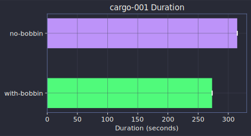

# Cargo (Rust)

## cargo-001 easy

**Commit**: [a96e747227](https://github.com/rust-lang/cargo/commit/a96e747227001f0752344077e25402ceb5cbf214)

Task prompt

> Fix `cargo check` to not panic when using `build-dir` config with a workspace
containing a proc macro that depends on a dylib crate. The code in
`compilation\_files.rs` calls `.expect("artifact-dir was not locked")` but
artifact-dir is never locked for check builds. Replace the `.expect()` calls
with `?` to propagate the None gracefully instead of panicking.

| Approach | Tests Pass | Precision | Recall | F1 | Duration | Cost |
|----------|:----------:|:---------:|:------:|:--:|:--------:|-----:|
| no-bobbin | 100.0% | 100.0% | 100.0% | 100.0% | 5.2m $1.04 |
| with-bobbin | 100.0% | 100.0% | 100.0% | 100.0% | 4.6m $1.03 |

**Ground truth files**: `src/cargo/core/compiler/build_runner/compilation_files.rs`, `tests/testsuite/check.rs`

**Files touched (no-bobbin)**: `src/cargo/core/compiler/build_runner/compilation_files.rs`, `tests/testsuite/check.rs`
**Files touched (with-bobbin)**: `src/cargo/core/compiler/build_runner/compilation_files.rs`, `tests/testsuite/check.rs`

---
