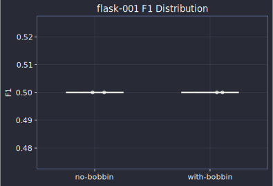
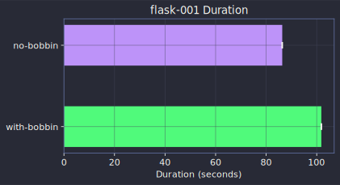

# Flask (Python)

## flask-001 medium

**Commit**: [8646edca6f](https://github.com/pallets/flask/commit/8646edca6f47e2cd57464081b3911218d4734f8d)

Task prompt

> Fix the Vary: Cookie header to be set consistently when the session is
accessed, modified, or refreshed. Previously, the header was only set when
the session was modified but not when it was merely accessed or when a
session cookie was being deleted. Move the Vary header logic so it covers
all code paths in save_session, including cookie deletion and session
refresh without modification.

| Approach | Tests Pass | Precision | Recall | F1 | Duration |
|----------|:----------:|:---------:|:------:|:--:|:--------:|
| no-bobbin | 50.0% | 100.0% | 33.3% | 50.0% | 57s |
| with-bobbin | 50.0% | 100.0% | 33.3% | 50.0% | 1.4m |

**Ground truth files**: `CHANGES.rst`, `src/flask/sessions.py`, `tests/test_basic.py`

**Files touched (no-bobbin)**: `src/flask/sessions.py`
**Files touched (with-bobbin)**: `src/flask/sessions.py`

---

## flask-002 medium

**Commit**: [1232d69860](https://github.com/pallets/flask/commit/1232d698600e11dcb83bb5dc349ca785eae02d2f)

Task prompt

> Refactor the CLI module to inline conditional imports (dotenv, ssl,
importlib.metadata) at their point of use instead of importing them at
module level. This avoids import errors and unnecessary imports when the
optional dependencies are not installed, and moves version-conditional
importlib.metadata handling into the method that actually uses it.

| Approach | Tests Pass | Precision | Recall | F1 | Duration |
|----------|:----------:|:---------:|:------:|:--:|:--------:|
| no-bobbin | 0.0% | 100.0% | 66.7% | 80.0% | 2.9m |
| with-bobbin | 0.0% | 100.0% | 66.7% | 80.0% | 2.7m |

**Ground truth files**: `setup.cfg`, `src/flask/cli.py`, `tests/test_cli.py`

**Files touched (no-bobbin)**: `src/flask/cli.py`, `tests/test_cli.py`
**Files touched (with-bobbin)**: `src/flask/cli.py`, `tests/test_cli.py`

---

## flask-003 medium

**Commit**: [fdab801fbb](https://github.com/pallets/flask/commit/fdab801fbbd9de5adbdb3320ca4a1cb116c892f5)

Task prompt

> Add a redirect method to the Flask app object and a new flask.redirect
helper function that delegates to it. This allows applications to customize
redirect behavior by overriding app.redirect. The flask.redirect function
checks for current_app and calls app.redirect if available, otherwise
falls back to werkzeug.utils.redirect. Update flask.\_\_init\_\_ to export
redirect from helpers instead of werkzeug.

| Approach | Tests Pass | Precision | Recall | F1 | Duration |
|----------|:----------:|:---------:|:------:|:--:|:--------:|
| no-bobbin | 0.0% | 100.0% | 60.0% | 75.0% | 2.4m |
| with-bobbin | 0.0% | 100.0% | 60.0% | 75.0% | 2.0m |

**Ground truth files**: `CHANGES.rst`, `src/flask/__init__.py`, `src/flask/app.py`, `src/flask/helpers.py`, `tests/test_helpers.py`

**Files touched (no-bobbin)**: `src/flask/__init__.py`, `src/flask/app.py`, `src/flask/helpers.py`
**Files touched (with-bobbin)**: `src/flask/__init__.py`, `src/flask/app.py`, `src/flask/helpers.py`

---

## flask-004 medium

**Commit**: [eb5dd9f5ef](https://github.com/pallets/flask/commit/eb5dd9f5ef255c578cbbe13c1cb4dd11389d5519)

Task prompt

> Add an aborter_class attribute and aborter instance to the Flask app object,
along with a make_aborter factory method. Create a new flask.abort helper
function that delegates to app.aborter when current_app is available,
otherwise falls back to werkzeug.exceptions.abort. This allows applications
to customize abort behavior, including registering custom HTTP error codes.
Update flask.\_\_init\_\_ to export abort from helpers instead of werkzeug.

| Approach | Tests Pass | Precision | Recall | F1 | Duration |
|----------|:----------:|:---------:|:------:|:--:|:--------:|
| no-bobbin | 0.0% | 100.0% | 60.0% | 75.0% | 2.5m |
| with-bobbin | 0.0% | 100.0% | 60.0% | 75.0% | 3.0m |

**Ground truth files**: `CHANGES.rst`, `src/flask/__init__.py`, `src/flask/app.py`, `src/flask/helpers.py`, `tests/test_helpers.py`

**Files touched (no-bobbin)**: `src/flask/__init__.py`, `src/flask/app.py`, `src/flask/helpers.py`
**Files touched (with-bobbin)**: `src/flask/__init__.py`, `src/flask/app.py`, `src/flask/helpers.py`

---
