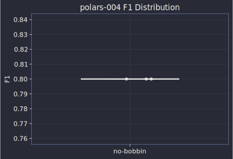
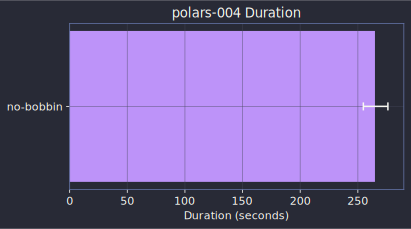
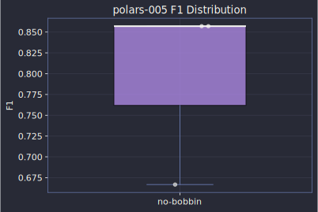
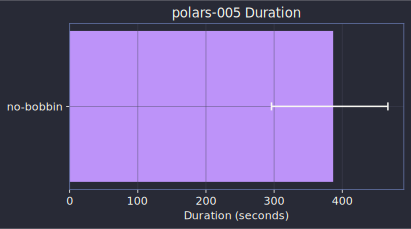

# Polars (Rust)

## polars-004 medium

**Commit**: [052e68fc47](https://github.com/pola-rs/polars/commit/052e68fc47a7be9500c99da063eac41afa180449)

Task prompt

> Fix the sortedness tracking for `concat\_str` with multiple inputs. The
optimizer incorrectly marks the output of `concat\_str` on multiple
columns as sorted, which can cause wrong results in downstream operations
that rely on sorted invariants. The fix should not propagate sortedness
metadata when concat\_str operates on multiple input columns, since
concatenating multiple sorted columns does not produce a sorted result.

Implement the fix. Run the test suite with the test command to verify.

| Approach | Tests Pass | Precision | Recall | F1 | Duration | Cost |
|----------|:----------:|:---------:|:------:|:--:|:--------:|-----:|
| no-bobbin | 100.0% | 100.0% | 66.7% | 80.0% | 4.4m | $0.81 |

**Ground truth files**: `crates/polars-plan/src/plans/optimizer/sortedness.rs`, `py-polars/tests/unit/lazyframe/test_optimizations.py`, `py-polars/tests/unit/streaming/test_streaming_join.py`

**Files touched (no-bobbin)**: `crates/polars-plan/src/plans/optimizer/sortedness.rs`, `py-polars/tests/unit/lazyframe/test_optimizations.py`

---

## polars-005 medium

**Commit**: [8f60a2d641](https://github.com/pola-rs/polars/commit/8f60a2d641daf7f9eeac69694b5c952f4cc34099)

Task prompt

> Fix inconsistent behavior when dividing literals by zero. Currently,
`pl.lit(1) // pl.lit(0)` produces different results depending on the
dtype: panics for unsigned types, returns 0 for same-type signed ints,
and returns null for mixed types. The correct behavior is to always
return null when dividing by zero, matching standard SQL/dataframe
semantics. Fix the literal simplification logic in the optimizer to
handle division-by-zero cases consistently.

Implement the fix. Run the test suite with the test command to verify.

| Approach | Tests Pass | Precision | Recall | F1 | Duration | Cost |
|----------|:----------:|:---------:|:------:|:--:|:--------:|-----:|
| no-bobbin | 100.0% | 100.0% | 66.7% | 79.4% | 6.4m | $1.74 |

**Ground truth files**: `crates/polars-plan/src/dsl/expr/mod.rs`, `crates/polars-plan/src/plans/optimizer/simplify_expr/mod.rs`, `crates/polars-utils/src/floor_divmod.rs`, `py-polars/tests/unit/expr/test_literal.py`

**Files touched (no-bobbin)**: `crates/polars-plan/src/plans/optimizer/simplify_expr/mod.rs`, `crates/polars-utils/src/floor_divmod.rs`, `py-polars/tests/unit/expr/test_literal.py`

---
