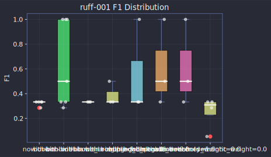
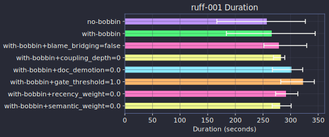
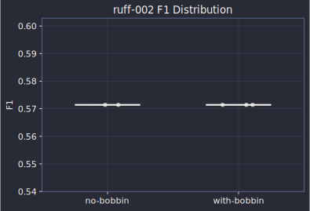
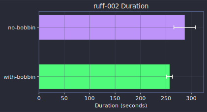
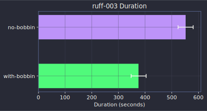
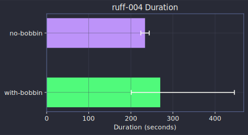
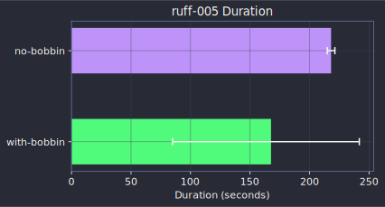

# Ruff (Rust)

## ruff-001 medium

**Commit**: [f14fd5d885](https://github.com/astral-sh/ruff/commit/f14fd5d88507553830d78cf3cfae625a17297ebd)

Task prompt

> Fix the Python formatter to preserve parentheses around exception handler
tuples when any element is a starred expression (Python 3.14+). Without
parentheses, a starred element in an except clause is parsed as `except*`
(exception group syntax) rather than a tuple containing a starred element,
changing semantics. Add a check for starred expressions in the tuple before
removing parentheses.

| Approach | Tests Pass | Precision | Recall | F1 | Duration |
|----------|:----------:|:---------:|:------:|:--:|:--------:|
| no-bobbin | 100.0% | 33.3% | 33.3% | 33.3% | 4.0m |
| with-bobbin | 100.0% | 66.7% | 66.7% | 66.7% | 4.1m |

**Ground truth files**: `crates/ruff_python_formatter/resources/test/fixtures/ruff/statement/try.py`, `crates/ruff_python_formatter/src/other/except_handler_except_handler.rs`, `crates/ruff_python_formatter/tests/snapshots/format@statement__try.py.snap`

**Files touched (no-bobbin)**: `crates/ruff_python_formatter/resources/test/fixtures/black/cases/remove_except_types_parens.py`, `crates/ruff_python_formatter/src/other/except_handler_except_handler.rs`, `crates/ruff_python_formatter/tests/snapshots/black_compatibility@cases__remove_except_types_parens.py.snap`
**Files touched (with-bobbin)**: `crates/ruff_python_formatter/resources/test/fixtures/ruff/statement/try.py`, `crates/ruff_python_formatter/src/other/except_handler_except_handler.rs`, `crates/ruff_python_formatter/tests/snapshots/format@statement__try.py.snap`

---

## ruff-002 easy

**Commit**: [ddeadcbd18](https://github.com/astral-sh/ruff/commit/ddeadcbd18a2b3319a2f5963c16191d14d44bca9)

Task prompt

> Add `multiprocessing.Value` to the list of functions excluded from the
flake8-boolean-trap rule FBT003. The `Value` constructor commonly takes a
boolean as its second argument (e.g., `Value("b", False)`), and this is a
legitimate use case that should not trigger a boolean positional argument
warning. Implement a new `is\_semantically\_allowed\_func\_call` helper that
uses qualified name resolution to match the call, and integrate it into the
existing `allow\_boolean\_trap` logic.

| Approach | Tests Pass | Precision | Recall | F1 | Duration |
|----------|:----------:|:---------:|:------:|:--:|:--------:|
| no-bobbin | 100.0% | 100.0% | 40.0% | 57.1% | 4.8m |
| with-bobbin | 100.0% | 100.0% | 40.0% | 57.1% | 4.2m |

**Ground truth files**: `crates/ruff_linter/resources/test/fixtures/flake8_boolean_trap/FBT.py`, `crates/ruff_linter/src/rules/flake8_boolean_trap/helpers.rs`, `crates/ruff_linter/src/rules/flake8_boolean_trap/snapshots/ruff_linter__rules__flake8_boolean_trap__tests__FBT001_FBT.py.snap`, `crates/ruff_linter/src/rules/flake8_boolean_trap/snapshots/ruff_linter__rules__flake8_boolean_trap__tests__FBT003_FBT.py.snap`, `crates/ruff_linter/src/rules/flake8_boolean_trap/snapshots/ruff_linter__rules__flake8_boolean_trap__tests__extend_allowed_callable.snap`

**Files touched (no-bobbin)**: `crates/ruff_linter/resources/test/fixtures/flake8_boolean_trap/FBT.py`, `crates/ruff_linter/src/rules/flake8_boolean_trap/helpers.rs`
**Files touched (with-bobbin)**: `crates/ruff_linter/resources/test/fixtures/flake8_boolean_trap/FBT.py`, `crates/ruff_linter/src/rules/flake8_boolean_trap/helpers.rs`

---

## ruff-003 medium

**Commit**: [80dbc62a76](https://github.com/astral-sh/ruff/commit/80dbc62a7654bfc6165f3f4dff46df10c94abb8a)

Task prompt

> Fix the pylint PLC2701 (import-private-name) rule in two ways: (1) Stop
flagging dunder submodules like `\_\_main\_\_` as private imports by using the
`is\_dunder` helper instead of a simple `starts\_with("\_\_")` check, which
incorrectly matched dunder names. (2) Improve diagnostic ranges to point
at the exact private name segment rather than the entire import binding,
using a tokenizer to locate the private segment in module paths and alias
name ranges for imported members.

| Approach | Tests Pass | Precision | Recall | F1 | Duration |
|----------|:----------:|:---------:|:------:|:--:|:--------:|
| no-bobbin | 100.0% | 100.0% | 66.7% | 80.0% | 9.7m |
| with-bobbin | 100.0% | 100.0% | 66.7% | 80.0% | 6.7m |

**Ground truth files**: `crates/ruff_linter/resources/test/fixtures/pylint/import_private_name/submodule/__main__.py`, `crates/ruff_linter/src/rules/pylint/rules/import_private_name.rs`, `crates/ruff_linter/src/rules/pylint/snapshots/ruff_linter__rules__pylint__tests__PLC2701_import_private_name__submodule____main__.py.snap`

**Files touched (no-bobbin)**: `crates/ruff_linter/src/rules/pylint/rules/import_private_name.rs`, `crates/ruff_linter/src/rules/pylint/snapshots/ruff_linter__rules__pylint__tests__PLC2701_import_private_name__submodule____main__.py.snap`
**Files touched (with-bobbin)**: `crates/ruff_linter/src/rules/pylint/rules/import_private_name.rs`, `crates/ruff_linter/src/rules/pylint/snapshots/ruff_linter__rules__pylint__tests__PLC2701_import_private_name__submodule____main__.py.snap`

---

## ruff-004 easy

**Commit**: [ceb876b823](https://github.com/astral-sh/ruff/commit/ceb876b82300bd237d11e3eb77c46fcf3d3afe85)

Task prompt

> Fix inconsistent handling of forward references (stringized annotations)
in the flake8-pyi PYI034 rule for `\_\_new\_\_`, `\_\_enter\_\_`, and `\_\_aenter\_\_`
methods. Previously, return type annotations using forward references like
`def \_\_new\_\_(cls) -> "MyClass"` were not detected, while non-stringized
versions were. Add a new `is\_name\_or\_stringized\_name` helper that uses
`match\_maybe\_stringized\_annotation` to resolve both plain and stringized
annotations, and use it for the return type checks.

| Approach | Tests Pass | Precision | Recall | F1 | Duration |
|----------|:----------:|:---------:|:------:|:--:|:--------:|
| no-bobbin | 100.0% | 33.3% | 33.3% | 33.3% | 4.1m |
| with-bobbin | 100.0% | 33.3% | 33.3% | 33.3% | 3.8m |

**Ground truth files**: `crates/ruff_linter/resources/test/fixtures/flake8_pyi/PYI034.py`, `crates/ruff_linter/src/rules/flake8_pyi/rules/non_self_return_type.rs`, `crates/ruff_linter/src/rules/flake8_pyi/snapshots/ruff_linter__rules__flake8_pyi__tests__PYI034_PYI034.py.snap`

**Files touched (no-bobbin)**: `crates/ruff_linter/resources/test/fixtures/flake8_pyi/PYI034.pyi`, `crates/ruff_linter/src/rules/flake8_pyi/rules/non_self_return_type.rs`, `crates/ruff_linter/src/rules/flake8_pyi/snapshots/ruff_linter__rules__flake8_pyi__tests__PYI034_PYI034.pyi.snap`
**Files touched (with-bobbin)**: `crates/ruff_linter/resources/test/fixtures/flake8_pyi/PYI034.pyi`, `crates/ruff_linter/src/rules/flake8_pyi/rules/non_self_return_type.rs`, `crates/ruff_linter/src/rules/flake8_pyi/snapshots/ruff_linter__rules__flake8_pyi__tests__PYI034_PYI034.pyi.snap`

---

## ruff-005 easy

**Commit**: [aa9c9bf01f](https://github.com/astral-sh/ruff/commit/aa9c9bf01fc32260359a1c0e727ed57c90fc642c)

Task prompt

> Suppress diagnostic output when running `ruff format --check --silent`.
The `--silent` flag was not being respected in format check mode, causing
"Would reformat" messages to still appear. Fix by wrapping the
output-writing match block in a `log\_level > LogLevel::Silent` guard so
that no stdout output is produced in silent mode. Add integration tests
for both `--silent` and `--quiet` modes to verify correct output behavior.

| Approach | Tests Pass | Precision | Recall | F1 | Duration |
|----------|:----------:|:---------:|:------:|:--:|:--------:|
| no-bobbin | 100.0% | 100.0% | 100.0% | 100.0% | 3.7m |
| with-bobbin | 100.0% | 100.0% | 100.0% | 100.0% | 4.0m |

**Ground truth files**: `crates/ruff/src/commands/format.rs`, `crates/ruff/tests/cli/format.rs`

**Files touched (no-bobbin)**: `crates/ruff/src/commands/format.rs`, `crates/ruff/tests/cli/format.rs`
**Files touched (with-bobbin)**: `crates/ruff/src/commands/format.rs`, `crates/ruff/tests/cli/format.rs`

---
