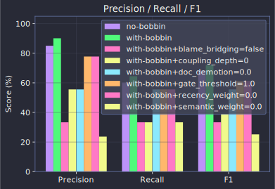
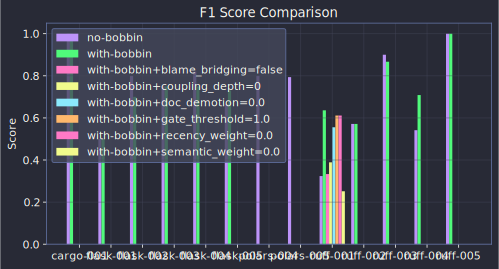
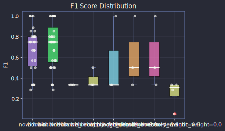
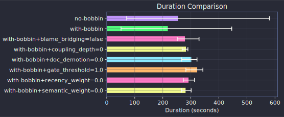
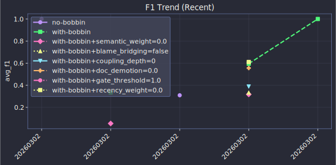

# Results Summary

## Overall Comparison

| Metric | no-bobbin | with-bobbin | Delta |
|--------|:---:|:---:|:---:|
| Runs | 10 | 5 | |
| Test Pass Rate | 50.0% | 0.0% | -50.0pp |
| Avg Precision | 89.3% | 100.0% | +10.7pp |
| Avg Recall | 66.8% | 54.0% | -12.8pp |
| Avg F1 | 73.1% | 69.3% | -3.8pp |
| Avg Duration | 3.9m | 2.3m | -41% |

## Metric Overview

## F1 Score by Task

## Score Distribution

## Duration

## Recent Trend

[Full historical trends](./trends.md)

## Per-Task Results

| Task | Language | Difficulty | Approach | Tests | Precision | Recall | F1 | Duration |
|------|----------|:----------:|----------|:-----:|:---------:|:------:|:--:|:--------:|
| flask-001 | python | medium | no-bobbin | 0.0% | 100.0% | 33.3% | 50.0% | 48s |
| flask-001 | python | medium | with-bobbin | 0.0% | 100.0% | 33.3% | 50.0% | 1.5m |
| flask-002 | python | medium | no-bobbin | 0.0% | 100.0% | 66.7% | 80.0% | 2.9m |
| flask-002 | python | medium | with-bobbin | 0.0% | 100.0% | 66.7% | 80.0% | 2.7m |
| flask-003 | python | medium | no-bobbin | 0.0% | 100.0% | 60.0% | 75.0% | 2.4m |
| flask-003 | python | medium | with-bobbin | 0.0% | 100.0% | 60.0% | 75.0% | 2.0m |
| flask-004 | python | medium | no-bobbin | 0.0% | 100.0% | 60.0% | 75.0% | 2.5m |
| flask-004 | python | medium | with-bobbin | 0.0% | 100.0% | 60.0% | 75.0% | 3.0m |
| flask-005 | python | easy | no-bobbin | 0.0% | 100.0% | 75.0% | 85.7% | 2.0m |
| flask-005 | python | easy | with-bobbin | 0.0% | 100.0% | 50.0% | 66.7% | 2.3m |
| ruff-001 | rust | medium | no-bobbin | 100.0% | 33.3% | 33.3% | 33.3% | 5.7m |
| ruff-002 | rust | easy | no-bobbin | 100.0% | 100.0% | 40.0% | 57.1% | 4.4m |
| ruff-003 | rust | medium | no-bobbin | 100.0% | 100.0% | 100.0% | 100.0% | 8.7m |
| ruff-004 | rust | easy | no-bobbin | 100.0% | 60.0% | 100.0% | 75.0% | 5.9m |
| ruff-005 | rust | easy | no-bobbin | 100.0% | 100.0% | 100.0% | 100.0% | 3.5m |
