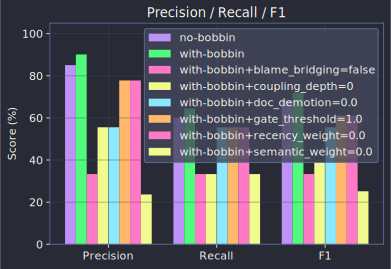
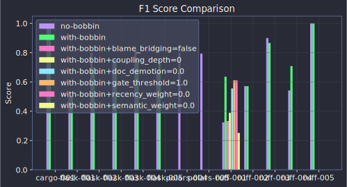
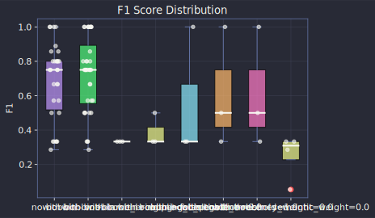
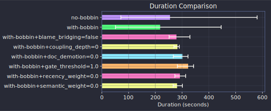
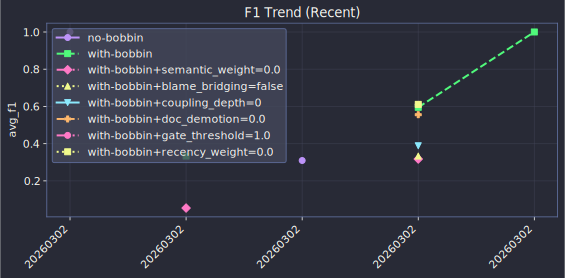

# Results Summary

## Overall Comparison

| Metric | no-bobbin | with-bobbin | with-bobbin+blame_bridging=false | with-bobbin+coupling_depth=0 | with-bobbin+doc_demotion=0.0 | with-bobbin+gate_threshold=1.0 | with-bobbin+recency_weight=0.0 | with-bobbin+semantic_weight=0.0 |
|--------|:---:|:---:|:---:|:---:|:---:|:---:|:---:|:---:|
| Runs | 30 | 36 | 3 | 3 | 3 | 3 | 3 | 4 |
| Test Pass Rate | 66.7% | 58.3% | 100.0% | 100.0% | 100.0% | 100.0% | 100.0% | 100.0% |
| Avg Precision | 85.1% | 90.1% | 33.3% | 55.6% | 55.6% | 77.8% | 77.8% | 23.6% |
| Avg Recall | 60.2% | 64.5% | 33.3% | 33.3% | 55.6% | 55.6% | 55.6% | 33.3% |
| Avg F1 | 68.3% | 71.9% | 33.3% | 38.9% | 55.6% | 61.1% | 61.1% | 25.2% |
| Avg Duration | 4.2m | 3.6m | 4.6m | 4.7m | 5.0m | 5.4m | 4.9m | 4.7m |
| Avg Cost | $1.24 | $1.44 | $1.25 | $1.45 | $1.48 | $1.39 | $1.43 | $1.45 |
| Avg Input Tokens | 1,250,122 | 1,788,633 | 1,517,002 | 1,780,506 | 1,882,003 | 1,711,955 | 1,813,406 | 1,812,429 |
| Avg Output Tokens | 7,411 | 8,918 | 7,551 | 8,723 | 8,933 | 8,572 | 8,413 | 9,374 |

## Metric Overview

## F1 Score by Task

## Score Distribution

## Duration

## Recent Trend

[Full historical trends](./trends.md)

## Per-Task Results

| Task | Language | Difficulty | Approach | Tests | Precision | Recall | F1 | Duration | Cost |
|------|----------|:----------:|----------|:-----:|:---------:|:------:|:--:|:--------:|-----:|
| cargo-001 | rust | easy | no-bobbin | 100.0% | 100.0% | 100.0% | 100.0% | 5.2m $1.04 |
| cargo-001 | rust | easy | with-bobbin | 100.0% | 100.0% | 100.0% | 100.0% | 4.6m $1.03 |
| flask-001 | — | — | no-bobbin | 0.0% | 100.0% | 33.3% | 50.0% | 1.3m $0.00 |
| flask-001 | — | — | with-bobbin | 0.0% | 100.0% | 33.3% | 50.0% | 1.3m $0.00 |
| flask-002 | — | — | no-bobbin | 0.0% | 100.0% | 66.7% | 80.0% | 3.1m $0.00 |
| flask-002 | — | — | with-bobbin | 0.0% | 100.0% | 55.6% | 70.0% | 3.5m $0.00 |
| flask-003 | — | — | no-bobbin | 0.0% | 100.0% | 60.0% | 75.0% | 2.2m $0.00 |
| flask-003 | — | — | with-bobbin | 0.0% | 100.0% | 60.0% | 75.0% | 2.4m $0.00 |
| flask-004 | — | — | no-bobbin | 0.0% | 100.0% | 70.0% | 81.9% | 3.3m $0.00 |
| flask-004 | — | — | with-bobbin | 0.0% | 100.0% | 60.0% | 75.0% | 3.2m $0.00 |
| flask-005 | — | — | no-bobbin | 0.0% | 100.0% | 50.0% | 66.7% | 2.6m $0.00 |
| flask-005 | — | — | with-bobbin | 0.0% | 100.0% | 58.3% | 73.0% | 1.9m $0.00 |
| polars-004 | rust | medium | no-bobbin | 100.0% | 100.0% | 66.7% | 80.0% | 4.4m $0.81 |
| polars-005 | rust | medium | no-bobbin | 100.0% | 100.0% | 66.7% | 79.4% | 6.4m $1.74 |
| ruff-001 | rust | medium | no-bobbin | 100.0% | 31.7% | 33.3% | 32.4% | 4.3m $1.23 |
| ruff-001 | rust | medium | with-bobbin | 100.0% | 70.2% | 61.9% | 63.6% | 4.4m $1.52 |
| ruff-001 | rust | medium | with-bobbin+blame_bridging=false | 100.0% | 33.3% | 33.3% | 33.3% | 4.6m $1.25 |
| ruff-001 | rust | medium | with-bobbin+coupling_depth=0 | 100.0% | 55.6% | 33.3% | 38.9% | 4.7m $1.45 |
| ruff-001 | rust | medium | with-bobbin+doc_demotion=0.0 | 100.0% | 55.6% | 55.6% | 55.6% | 5.0m $1.48 |
| ruff-001 | rust | medium | with-bobbin+gate_threshold=1.0 | 100.0% | 77.8% | 55.6% | 61.1% | 5.4m $1.39 |
| ruff-001 | rust | medium | with-bobbin+recency_weight=0.0 | 100.0% | 77.8% | 55.6% | 61.1% | 4.9m $1.43 |
| ruff-001 | rust | medium | with-bobbin+semantic_weight=0.0 | 100.0% | 23.6% | 33.3% | 25.2% | 4.7m $1.45 |
| ruff-002 | rust | easy | no-bobbin | 100.0% | 100.0% | 40.0% | 57.1% | 4.8m $0.00 |
| ruff-002 | rust | easy | with-bobbin | 100.0% | 100.0% | 40.0% | 57.1% | 4.3m $1.38 |
| ruff-003 | rust | medium | no-bobbin | 100.0% | 100.0% | 83.3% | 90.0% | 9.2m $0.00 |
| ruff-003 | rust | medium | with-bobbin | 100.0% | 100.0% | 77.8% | 86.7% | 6.3m $1.92 |
| ruff-004 | rust | easy | no-bobbin | 100.0% | 46.7% | 66.7% | 54.2% | 3.9m $0.00 |
| ruff-004 | rust | easy | with-bobbin | 100.0% | 63.3% | 83.3% | 70.8% | 4.5m $1.67 |
| ruff-005 | rust | easy | no-bobbin | 100.0% | 100.0% | 100.0% | 100.0% | 3.6m $0.00 |
| ruff-005 | rust | easy | with-bobbin | 100.0% | 100.0% | 100.0% | 100.0% | 2.8m $0.63 |
