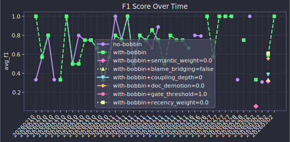
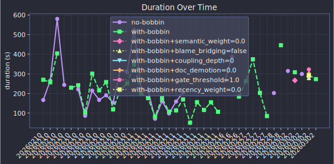

# Historical Trends

## F1 Trend

## Test Pass Rate Trend

## Duration Trend

## Run Comparison

| Run | Completed | Pass Rate | Avg F1 | Avg Duration |
|-----|-----------|:---------:|:------:|:------------:|
| 20260210 | 2 | 0.0% | 50.0% | 1.1m |
| 20260210 | 2 | 0.0% | 80.0% | 2.8m |
| 20260210 | 2 | 0.0% | 75.0% | 2.2m |
| 20260210 | 2 | 0.0% | 75.0% | 2.7m |
| legacy | 2 | 100.0% | 50.0% | 1.2m |

## Task Heatmap

