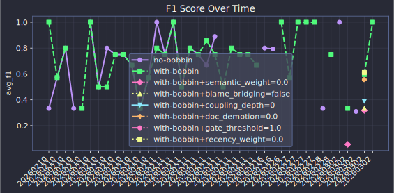
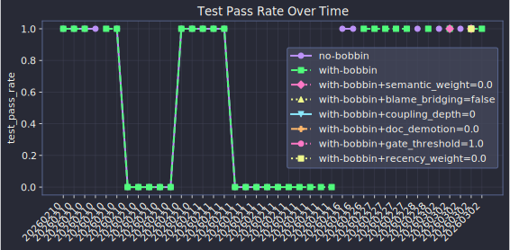
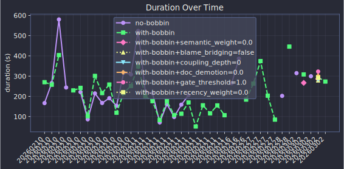
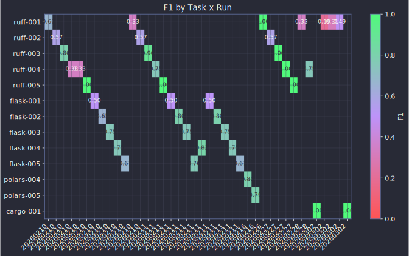

# Historical Trends

## F1 Trend

## Test Pass Rate Trend

## Duration Trend

## Run Comparison

| Run | Completed | Pass Rate | Avg F1 | Avg Duration |
|-----|-----------|:---------:|:------:|:------------:|
| 20260210 | 2 | 100.0% | 66.7% | 3.6m |
| 20260210 | 2 | 100.0% | 57.1% | 4.4m |
| 20260210 | 2 | 100.0% | 80.0% | 8.2m |
| 20260210 | 1 | 100.0% | 33.3% | 4.1m |
| 20260210 | 1 | 100.0% | 33.3% | 3.8m |
| 20260210 | 2 | 100.0% | 100.0% | 3.9m |
| 20260210 | 2 | 0.0% | 50.0% | 1.6m |
| 20260210 | 2 | 0.0% | 65.0% | 4.3m |
| 20260210 | 2 | 0.0% | 75.0% | 3.2m |
| 20260210 | 2 | 0.0% | 75.0% | 3.7m |
| 20260210 | 2 | 0.0% | 66.7% | 2.3m |
| 20260210 | 2 | 100.0% | 33.3% | 4.4m |
| 20260210 | 2 | 100.0% | 57.1% | 4.7m |
| 20260211 | 2 | 100.0% | 90.0% | 7.3m |
| 20260211 | 2 | 100.0% | 75.0% | 3.5m |
| 20260211 | 2 | 100.0% | 100.0% | 3.3m |
| 20260211 | 2 | 0.0% | 50.0% | 1.3m |
| 20260211 | 2 | 0.0% | 80.0% | 2.8m |
| 20260211 | 2 | 0.0% | 75.0% | 1.7m |
| 20260211 | 2 | 0.0% | 76.2% | 2.3m |
| 20260211 | 2 | 0.0% | 81.9% | 3.1m |
| 20260211 | 1 | 0.0% | 50.0% | 51s |
| 20260211 | 1 | 0.0% | 80.0% | 2.6m |
| 20260211 | 1 | 0.0% | 75.0% | 1.9m |
| 20260211 | 1 | 0.0% | 75.0% | 2.6m |
| 20260211 | 1 | 0.0% | 66.7% | 1.8m |
| 20260216 | 3 | 100.0% | 80.0% | 4.4m |
| 20260216 | 3 | 100.0% | 79.4% | 6.4m |
| 20260226 | 1 | 100.0% | 100.0% | 3.1m |
| 20260227 | 1 | 100.0% | 57.1% | 4.4m |
| 20260227 | 1 | 100.0% | 100.0% | 6.2m |
| 20260227 | 1 | 100.0% | 100.0% | 3.4m |
| 20260227 | 1 | 100.0% | 100.0% | 1.4m |
| 20260228 | 1 | 100.0% | 33.3% | 3.4m |
| 20260228 | 1 | 100.0% | 75.0% | 7.4m |
| 20260302 | 1 | 100.0% | 100.0% | 5.2m |
| 20260302 | 2 | 100.0% | 19.4% | 4.8m |
| 20260302 | 2 | 100.0% | 30.9% | 5.0m |
| 20260302 | 21 | 100.0% | 48.8% | 4.9m |
| 20260302 | 1 | 100.0% | 100.0% | 4.6m |

## Task Heatmap

