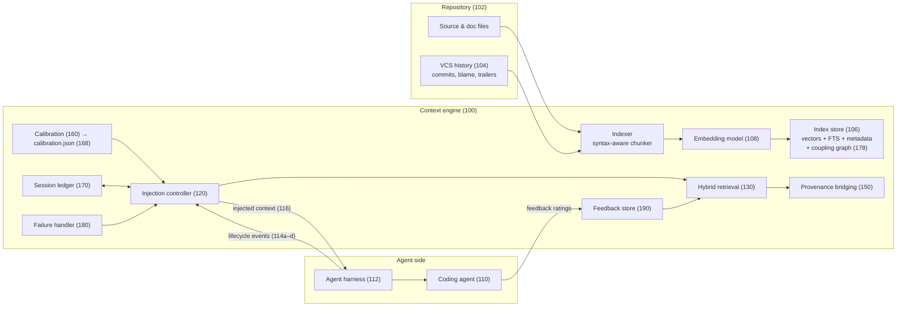
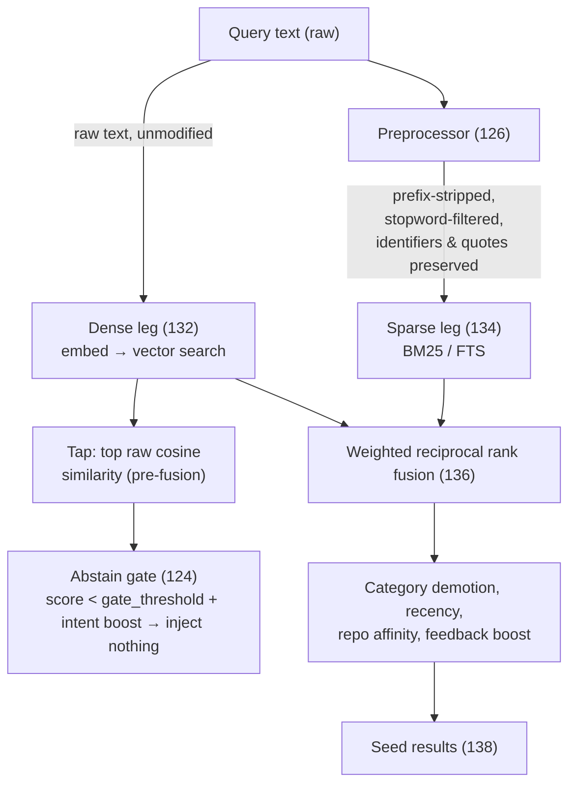
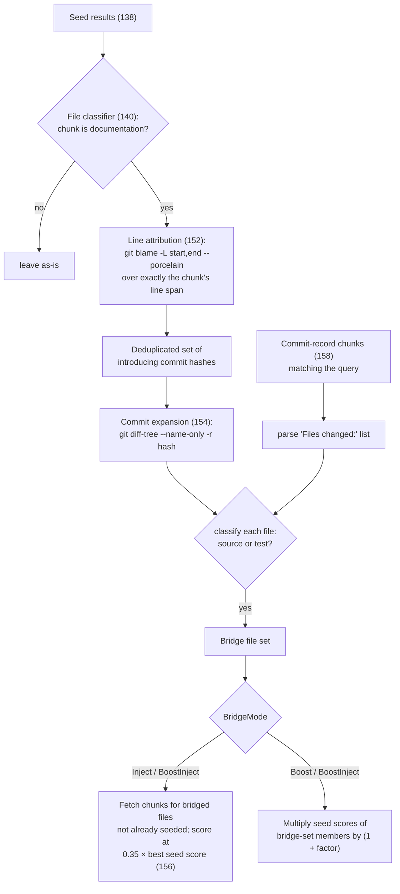
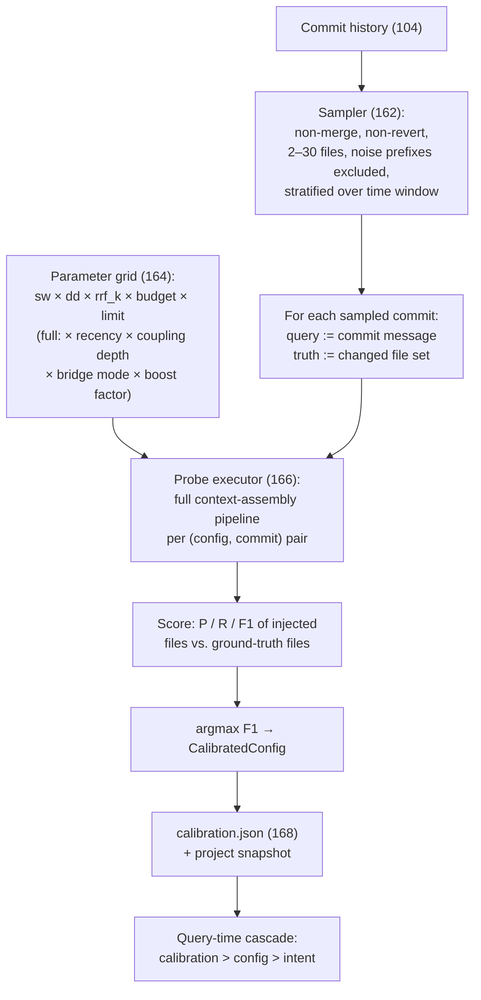
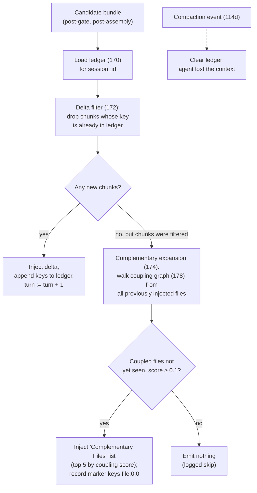
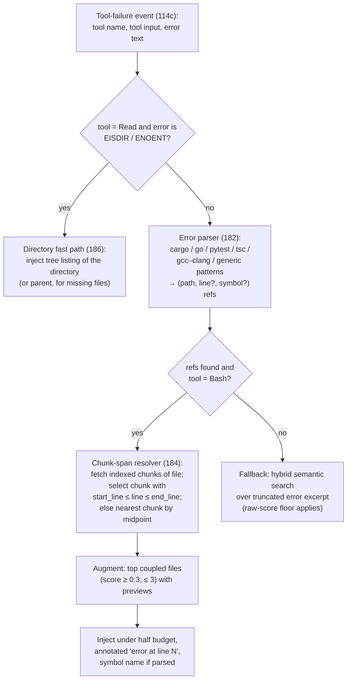
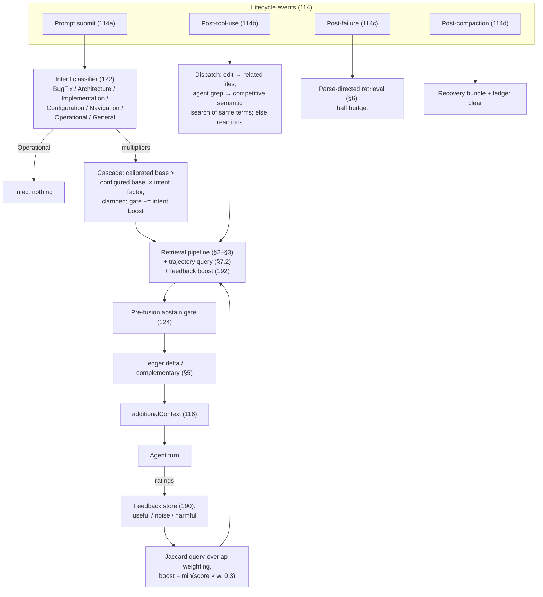

# PROVISIONAL PATENT APPLICATION

## Event-Driven Context Injection for Language-Model Coding Agents Using Version-Control Provenance, Self-Supervised Calibration, and Session-Scoped Delta Injection

**Inventor:** Stephen C. Brown

**Filing type:** Provisional application for patent under 35 U.S.C. § 111(b)

**Docket reference:** bobbin-retrieval-cluster-001

---

## FIELD OF THE INVENTION

The present invention relates to software development tools, and more particularly to systems and methods for automatically retrieving source-code context and injecting it into the working context of a language-model-based coding agent. Specific aspects relate to (i) the use of version-control line-attribution ("blame") data to bridge from documentation retrieval hits to the source files those documentation passages describe; (ii) self-supervised calibration of retrieval hyperparameters using a repository's own commit history as labeled training data; (iii) session-scoped tracking of previously injected context to enable delta injection and complementary expansion; (iv) failure-triggered retrieval directed by parsed compiler and test output rather than by embedding similarity; and (v) a closed-loop injection controller that combines these mechanisms across multiple agent lifecycle events.

---

## BACKGROUND

### Language-model coding agents and their context problem

Language-model ("LLM") coding agents are software programs in which a large language model iteratively invokes tools — file reads, file edits, shell commands, searches — inside an agent harness in order to accomplish a software engineering task. The agent's effectiveness is bounded by what is present in its context window: the model can only reason about code it has seen. Because context windows are finite and metered, an agent working in a large repository spends a substantial fraction of its turns, tokens, and wall-clock time *exploring* — running searches, listing directories, and reading files — before it can begin the requested change.

Retrieval-augmented generation ("RAG") systems for code address part of this problem by embedding code fragments into a vector space and retrieving fragments similar to a query. However, existing arrangements are almost universally **retrieval-on-request**: the agent (or the user) must decide to search, must formulate a query, and must spend a turn doing so. The complementary architecture — **unsolicited injection**, in which an external system observes the agent's lifecycle and pushes context into the agent's next turn without being asked — raises a set of technical problems that retrieval-on-request systems do not face, and which the prior art does not solve. The present invention addresses five such problems.

### Problem 1: Documentation dominates semantic retrieval yet is disjoint from the files that need editing

Natural-language task prompts ("fix the frobnicator flag parsing") are semantically far closer to natural-language artifacts in the repository — changelogs, release notes, README sections, design documents — than to the source code that implements the behavior. A changelog entry literally names the feature in prose; the implementing function does not. In measurements conducted by the inventor on a benchmark of software-repair tasks against a large production Python/Rust repository, **84% of chunks injected by a conventional hybrid (dense + lexical) retriever were changelog or markdown chunks (31 of 37 injected files across five evaluation tasks), while the overlap of injected files with the ground-truth files actually modified by the reference fix was approximately 6%**. The retriever was working as designed — the documentation *is* the most similar text — yet the injected context was nearly useless for editing. Simply demoting or excluding documentation discards real signal: the matching changelog entry is often the single strongest indicator of *which change introduced the behavior in question*. What is needed is a mechanism that converts a documentation hit into the source files that the documentation passage is *about*, with precision finer than file-level co-change statistics can provide.

### Problem 2: Retrieval hyperparameters are repository-sensitive and no labeled data exists

Hybrid retrieval systems expose numerous hyperparameters: the relative weighting of dense (semantic) versus sparse (lexical) rankings, rank-fusion constants, demotion factors for documentation, recency weighting, co-change expansion depth, result limits, and injection budgets. The optimal settings vary widely between repositories — a documentation-heavy monorepo with terse commit messages wants very different settings than a small library with disciplined conventional commits. In conventional practice these parameters are set globally by the vendor or hand-tuned by an expert. No labeled relevance data ("for query Q, files F are relevant") exists for an arbitrary private repository, and asking users to produce it is impractical. What is needed is a way to derive per-repository relevance supervision *from artifacts the repository already contains*.

### Problem 3: Repeated injection wastes the context window

An unsolicited injector fires on every user prompt. Consecutive prompts within a session are typically about the same topic, so a stateless injector injects substantially the same chunks turn after turn, consuming the agent's context window with redundant material, increasing cost, and degrading model attention. The naive fix — suppressing injection when results repeat — throws away an opportunity: the injector *knows* what the agent has already seen, and that knowledge can be used to select material that is related to, but disjoint from, the already-seen set.

### Problem 4: Tool failures are the highest-value retrieval trigger, yet are unaddressed

When a compiler, test runner, or type checker fails, the error output identifies — often to the exact file, line, and symbol — precisely the code the agent must now examine. This is the one moment in an agent's lifecycle when the system knows with near-certainty what context is needed. Embedding-based retrieval is a poor fit for this moment: error output is noisy, template-heavy text that embeds badly, and similarity search over it produces diffuse results. The direct approach — parse the error, fetch the indexed chunk whose line span contains the error line — is faster and more precise, but no known injection system performs it.

### Problem 5: A single retrieval policy cannot serve all lifecycle events

Prompt submission, file edits, tool failures, and context-window compaction are different retrieval situations demanding different parameterizations — and sometimes demanding *no injection at all* (an agent typing `git push` gains nothing from code context, and an abstention decision requires a score that actually measures absolute relevance, which rank-fusion-normalized scores do not). The prior art treats injection as a single undifferentiated behavior.

### Known prior art acknowledged

The following techniques are acknowledged as known and are **not** claimed in isolation: reciprocal rank fusion of multiple rankers (Cormack et al., 2009); syntax-aware code chunking using incremental parsers such as tree-sitter; git "temporal coupling" / co-change mining per se (Zimmermann et al.; tools such as code-maat); the SZZ algorithm for locating bug-introducing commits; dense retrieval with learned embeddings; and BM25-style lexical retrieval. The invention lies in the specific mechanisms described herein — provenance bridging of retrieval hits through line-attribution data, self-supervised calibration from commit history, session-ledger delta injection with complementary expansion, failure-triggered parse-directed retrieval — and in their combination into a closed-loop, event-driven injection controller.

---

## SUMMARY OF THE INVENTION

The invention is embodied in a local-first code context engine that indexes a code repository (syntax-aware chunking, learned embeddings, a vector store with full-text search) and attaches to a coding agent's harness through lifecycle hooks, injecting retrieved context into the agent's turns without being asked. Within that engine, the following aspects are disclosed.

**In one aspect**, a method of *provenance bridging* converts documentation retrieval hits into source-file context: when a retrieved chunk is classified as documentation, the system executes a line-attribution query (e.g., `git blame -L<start>,<end> --porcelain`) over exactly that chunk's line span; collects the set of commits that introduced those lines; expands each commit to the set of files it changed; filters that set to source and test files; and injects chunks from those files as "bridged" context scored at a fixed fraction (in one embodiment 0.35×) of the seed score. A mirror direction operates on indexed commit records: when a commit-message chunk matches the query, its recorded changed-file list is parsed and bridged identically. Four bridge modes are provided — Off, Inject (add bridged chunks), Boost (multiply the scores of seed results that are also bridge targets), and BoostInject (both) — selectable per repository, including automatically by the calibration aspect below.

**In another aspect**, a method of *self-supervised retrieval calibration* derives per-repository hyperparameters with no human labeling: commits are sampled from the indexed repository's own history under quality filters (non-merge, non-revert, 2–30 changed files, noise-prefix exclusion, stratified over time); each sampled commit's *message* is used as a synthetic query and its *changed file set* as relevance ground truth; a grid of retrieval configurations (semantic weight × documentation demotion × rank-fusion constant × injection budget × search limit, extended in a full sweep by recency half-life, recency weight, co-change depth, bridge mode, and bridge boost factor — up to 19,200 probes) is executed through the full context-assembly pipeline; each configuration is scored by precision/recall/F1 of injected files against the ground-truth file sets; and the winning configuration is persisted to a calibration record consumed at query time under a defined precedence cascade (calibration > static configuration > intent adjustment). Calibration runs automatically at the end of indexing, guarded by a snapshot comparison so it re-runs only when the repository has drifted.

**In another aspect**, a method of *session-scoped delta injection* maintains a per-agent-session ledger: every injected chunk is recorded under a stable key (file path : start line : end line) together with a monotonically increasing turn counter, in an append-only per-session store; on each subsequent injection the candidate set is filtered against the ledger so only not-yet-seen chunks are injected; and when the filtered delta is empty, the system — rather than remaining silent — performs *complementary expansion*: it walks the repository's co-change coupling graph outward from the set of files already injected in the session and injects identifications of coupled-but-unseen files, recording marker entries so the same suggestions are not repeated. A cheaper fallback fingerprints the topic of an injection (a cryptographic hash over the top-N candidate chunk keys) and suppresses byte-identical repeat injections. The ledger is deliberately cleared when the agent's context window is compacted, because the agent has lost the previously injected material.

**In another aspect**, a method of *failure-triggered parse-directed retrieval* responds to tool-failure lifecycle events: the failing tool's output is parsed by format-specific parsers (Rust/cargo, Go, Python/pytest, TypeScript/tsc, C/C++ compilers, and a generic fallback) into structured references (file path, line number, symbol); for each reference the system fetches, *without any embedding search*, the indexed chunk whose line span contains the referenced line (falling back to the nearest chunk by line distance); augments it with that file's most strongly co-changing files; and injects the result under a reduced budget. A fast path detects directory-read failures (EISDIR / file-not-found) and injects a directory listing instead.

**In another aspect**, the above mechanisms are combined into a *closed-loop injection controller*: multiple agent lifecycle events (prompt submission, post-tool-use, post-tool-failure, post-compaction session restart) each trigger differently parameterized retrieval; an abstain gate is evaluated on the **pre-fusion raw cosine similarity** of the best dense result — because post-fusion max-normalized scores pin the top hit near 1.0 and are useless as an absolute abstention signal; a keyword-based intent classifier rewires the hyperparameters as multipliers per query, including an "operational" intent whose adjustment is to inject nothing at all; agent feedback ratings (useful / noise / harmful) recorded against past injections are propagated to future queries by Jaccard keyword-overlap weighting, with the resulting boost bounded (in one embodiment capped at 0.3, i.e., at most a 30% score adjustment); and query text is preprocessed *asymmetrically* — the raw conversational text feeds the dense leg while a stopword-and-prefix-stripped variant feeds the sparse leg.

**Further aspects** include: cross-repository coupling derived from issue-identifier co-occurrence in commit trailers (with temporal proximity between commits of different repositories explicitly rejected as a coupling signal); conversational-trajectory query enrichment, in which the last N prompts of the session are persisted and concatenated with the current prompt under a character budget with a separator token; and budget partitioning of the injected bundle with reserved sub-budgets for administratively pinned chunks.

---

## BRIEF DESCRIPTION OF THE DRAWINGS

The drawings are presented as textual diagrams within the Detailed Description.

**FIG. 1** is a block diagram of the overall system (100), showing the indexed repository (102), version-control history (104), index store (106), embedding model (108), the coding agent (110) and its harness (112), the lifecycle events (114a–114d), the injection controller (120), and the retrieval, bridging, calibration, ledger, and failure-handling modules.

**FIG. 2** is a data-flow diagram of the hybrid retrieval substrate, showing asymmetric query preprocessing (126) feeding a dense leg (132) and a sparse leg (134), rank fusion (136), and the pre-fusion abstain gate (124) tapping the raw dense score upstream of fusion.

**FIG. 3** is a flow diagram of provenance bridging (150), showing the documentation→source direction through the line-attribution engine (152) and commit expansion (154), and the mirror commit→source direction through commit-record chunks (158).

**FIG. 4** is a flow diagram of the self-supervised calibration loop (160), from commit sampling (162) through grid probing (164, 166) to the persisted calibration record (168) and its consumption cascade.

**FIG. 5** is a decision-flow diagram of the session ledger (170), delta filtering (172), topic fingerprinting (176), and complementary expansion (174) over the co-change coupling graph (178).

**FIG. 6** is a flow diagram of failure-triggered parse-directed retrieval (180), including the error output parser (182), chunk-span resolver (184), coupled-file augmentation, and the directory fast path (186).

**FIG. 7** is a diagram of the parameter precedence cascade and the per-event parameterization of the closed-loop controller (120), including intent classification (122) and feedback weighting (192).

---

## DETAILED DESCRIPTION

The following description is made with reference to a working embodiment implemented by the inventor in the Rust programming language, using tree-sitter for syntax-aware chunking, ONNX-format sentence-embedding models executed locally for dense retrieval, an embedded LanceDB vector store with an integrated full-text (BM25/tantivy) index for sparse retrieval, git as the version-control system, and the Claude Code agent harness's hook interface as the lifecycle-event source. These concrete choices are exemplary only. Throughout this description, wherever git is named, any version-control system providing per-line authorship attribution and per-commit changed-file enumeration may be substituted; wherever a specific embedding model or vector store is named, any embedding model and any approximate- or exact-nearest-neighbor store may be substituted; wherever the Claude Code hook interface is named, any agent harness exposing lifecycle events with an input describing the event and an output channel for injected context may be substituted, including harnesses in which the "hook" is an in-process callback, a subprocess exchanging JSON over standard streams, an HTTP endpoint, or a Model Context Protocol server. The invention is likewise not limited to line-oriented budgets (token budgets are an explicitly supported alternative), to cosine similarity (any vector similarity may be used), or to the specific constant values recited, which are tunable and in several cases *tuned automatically by the calibration aspect itself*.

### 1. System overview (FIG. 1)

A system (100) according to the invention comprises an indexing subsystem and an injection subsystem, both operating locally against a code repository (102) and its version-control history (104).

**Indexing.** The indexer walks the repository, parses each file with a syntax-aware incremental parser, and emits chunks aligned to syntactic units (functions, types, impl blocks, headed markdown sections) rather than fixed windows. Each chunk records its file path, start line, end line, language, symbol name, and a chunk type; chunk types include at least source-code types, documentation types, and — significantly for the bridging aspect — a *commit* type: recent commits are themselves indexed as chunks whose content includes the commit message and an enumeration of the files the commit changed ("Files changed: …"). Each chunk is embedded by a locally executed embedding model (108) and stored in an index store (106) providing both vector similarity search and full-text search. A metadata store additionally holds a **co-change coupling graph (178)**: for pairs of files that changed together in commits, an edge scored by a weighted combination of normalized co-change frequency and recency decay. Coupling mining per se is acknowledged prior art; it is consumed here as a substrate by several of the claimed mechanisms.

**Injection.** The injection controller (120) registers with the agent harness (112) for a plurality of lifecycle events (114): (a) prompt-submission events (114a), fired when the user submits a prompt and before the agent's turn begins; (b) post-tool-use events (114b), fired after a tool such as a file edit or a shell search completes; (c) post-tool-failure events (114c), fired when a tool invocation fails; and (d) session-restart-after-compaction events (114d), fired when the harness has compacted (summarized and truncated) the agent's context window. On each event the controller receives a structured input (session identifier, working directory, prompt text or tool name/input/error) on its standard input and may emit a structured output whose `additionalContext` field the harness splices into the agent's context (116). The controller is engineered never to block the agent: every failure path degrades to emitting nothing, and hook commands are registered with short timeouts and an unconditional success exit.

Each event class triggers a **differently parameterized** retrieval, described in §8. The common retrieval substrate is described next.

### 2. Hybrid retrieval substrate with asymmetric preprocessing and a pre-fusion abstain gate (FIG. 2)

**Asymmetric query preprocessing (126).** Conversational prompts ("Can you help me fix the authentication bug?") embed well semantically but produce noisy lexical matches. The system therefore prepares *two different query strings from one input*. The dense leg (132) receives the raw text unmodified, because learned embeddings benefit from full natural-language context. The sparse leg (134) receives a transformed variant: leading conversational prefixes are stripped from a fixed table ("can you help me", "how do i", "show me", …); quoted phrases are extracted and preserved verbatim; tokens that are code-like — containing underscores, dots, path separators, `::`, or all-uppercase identifiers — are always preserved; and remaining tokens are filtered against a deliberately minimal stopword list (articles, pronouns, auxiliaries, conversational fillers such as "please", "help", "check", "look"). If filtering removes everything, the stripped original is used as a fallback so the sparse leg never receives an empty query. This asymmetry is a distinct inventive detail: symmetric preprocessing either starves the embedding of context or floods BM25 with function words.

**Fusion (136).** The two ranked lists are combined by weighted reciprocal rank fusion: each result contributes `w / (k + rank + 1)` where `w` is the semantic weight for the dense list and its complement for the sparse list, and `k` is the fusion constant (default 60, a calibratable parameter). RRF per se is acknowledged prior art (Cormack et al., 2009).

**The pre-fusion abstain gate (124).** An unsolicited injector must be able to *decline to inject*. The natural candidate signal — the score of the top fused result — is unusable for this purpose: fused scores are max-normalized (the top result is pinned at or near 1.0 regardless of whether it is an excellent match or merely the least-bad of a bad set), and rank-fusion arithmetic destroys absolute magnitude. The invention therefore taps the **raw cosine similarity of the best dense result upstream of fusion** and carries it through bundle assembly as a `top_semantic_score` field alongside, but never blended into, the fused scores. At injection time the controller compares this raw score against a gate threshold (default 0.45 in the working embodiment, configurable, and additively raised per intent class, §8): if the best raw similarity is below the gate, nothing is injected at all. Empirically the gate's contribution is real but deliberately modest (−0.025 F1 when disabled by setting the gate to 1.0 in the ablation of §10): its purpose is precision protection — suppressing injection on off-topic prompts — not ranking. Fully disabling injection via the gate on *all* queries would forfeit the entire benefit, so the threshold sits well below typical on-topic scores.

**Post-fusion adjustments.** After fusion, per-result multipliers are applied: a documentation-demotion multiplier for chunks classified as documentation (see §3), a recency multiplier derived from an exponential half-life over the chunk's last-modified time, a repository-affinity boost for results from the agent's current repository in multi-repository indexes, a feedback-derived boost (§8), and a pinning transform (§9). Chunks carrying an administrative "pin" tag bypass category demotion entirely.

### 3. Provenance bridging: converting documentation hits into source context (FIG. 3)

#### 3.1 The problem, quantified

As set out in the Background, measurement on five software-repair evaluation tasks showed 84% of injected chunks (31/37 files) were changelog/markdown despite ~6% ground-truth overlap with the files actually edited by the reference fixes. The key insight of this aspect is that a documentation chunk that matches the query is not noise to be discarded — it is a *pointer*. The changelog entry describing "the frobnicator flag" was added to the changelog **in a specific commit**, and that same commit (or those same commits) touched the source files that implement the feature. Line-attribution data recovers exactly those commits, at line granularity. This is categorically more precise than file-level co-change coupling: coupling would relate the changelog file to *every* file it ever co-changed with (in practice, nearly the whole repository, since changelogs are touched by most commits), whereas blame over one chunk's line span isolates the handful of commits that wrote *those particular lines*.

#### 3.2 Operation, documentation→source direction

In one embodiment the method proceeds as follows for each seed result:

1. **Classification (140).** The seed's file path is classified into categories — Source, Test, Documentation, Configuration, etc. — by extension and path rules (e.g., `.md`, `CHANGELOG*`, `docs/` → Documentation), with the rule set user-extensible in configuration. Only Documentation seeds proceed.
2. **Line attribution (152).** The system executes the version-control line-attribution command over *exactly the chunk's line span* — in the git embodiment, `git blame -L <start_line>,<end_line> --porcelain -- <file>` — and parses the machine-readable output into one (commit hash, line number) record per attributed line. The porcelain parser identifies attribution lines by their leading 40-hex-character hash. A variant `blame_lines_at_rev` performs the same attribution as of an arbitrary revision, used elsewhere for SZZ-style culprit analysis (acknowledged art) and available to bridging embodiments that index historical snapshots.
3. **Commit deduplication.** The per-line hashes are collapsed to a set — a chunk whose lines arrived in two commits yields two.
4. **Commit expansion (154).** Each introducing commit is expanded to its changed-file list (`git diff-tree --no-commit-id --name-only -r <hash>`). Relative paths returned by the version-control tool are resolved against the repository root to match the index's stored path format.
5. **Filtering.** Each expanded file is classified; only Source and Test files enter the bridge set. This prevents documentation→documentation amplification (the commit also touched the changelog itself).

#### 3.3 Operation, commit→source direction (the mirror)

Because commits are indexed as chunks (§1), a query may match a *commit record* directly ("what changed in the flag parser last week" matches a commit message). During hybrid search, commit-type chunks are captured from both the dense and sparse candidate lists *before* being filtered out of the seed results (they are pointers, not injectable code), capped at a small number (three in the working embodiment) to prevent bridge explosion from many loose matches. Each captured commit chunk's content is parsed for its recorded "Files changed:" enumeration, and those files enter the same classify-and-filter path as step 5 above. The two directions share one bridge-set collector.

#### 3.4 The four bridge modes and scoring

A `BridgeMode` enumeration selects among:

- **Off** — bridging disabled; the collector returns an empty set.
- **Inject** — for each bridge-set file not already present among the seeds (capped at `max_bridged_files` files and `max_bridged_chunks_per_file` chunks per file), fetch its chunks from the index and append them to the bundle as bridged relevance (156), each scored at a **fixed fraction of the best seed score — 0.35× in the working embodiment** — reflecting that bridged files are speculative relative to direct hits. The fraction was reduced from an earlier 0.5× after evaluation; it is an explicitly tunable parameter.
- **Boost** — do not add new chunks; instead multiply the score of every *seed* result whose file is in the bridge set by `(1 + bridge_boost_factor)`, letting provenance evidence re-rank the existing candidates.
- **BoostInject** — apply both behaviors.

The mode and boost factor are per-repository parameters and are among the dimensions swept by the calibration aspect (§4), so a given repository converges to the empirically best mode without human tuning. Bridged chunks are labeled in the injected output with their origin ("bridge") so the agent can weigh them.

#### 3.5 Measured effect

In the ablation study of §10, disabling blame bridging alone reduced end-task F1 from 0.636 to 0.333 (−0.303) — the **second-largest single contribution** of any mechanism in the system, exceeded only by disabling semantic search entirely (−0.384). Notably, runs with bridging disabled exhibited zero variance across repetitions (0.333 ± 0.000, n=3), indicating the agent deterministically converges to the same inferior exploration pattern without the bridged files.

#### 3.6 Alternative embodiments

Any version-control system exposing line-level authorship (Mercurial `annotate`, Perforce `annotate`, SVN `blame`) may substitute for git. The line-attribution query may be served from a pre-computed attribution index rather than invoking the VCS per query. The bridge fraction may be a learned function of seed score, chunk category, or commit age rather than a constant. The documentation classifier may be a learned classifier rather than rule-based. Bridging may be applied transitively (bridged file → its own strongly-coupled files) with per-hop decay. The commit→source direction may parse structured commit metadata from the VCS directly instead of from indexed chunk text.

### 4. Self-supervised retrieval calibration from the repository's own history (FIG. 4)

#### 4.1 Principle

A commit is a naturally occurring labeled retrieval example: its **message** is a human-written natural-language description of an intent, and its **changed file set** is the ground-truth answer to "which files does acting on that intent touch." A repository with a few hundred commits therefore already contains a relevance-judged query set specific to its own vocabulary, structure, and documentation habits. The calibration aspect exploits this to tune the retrieval hyperparameters of §2–§3 per repository, with zero human labeling.

#### 4.2 Commit sampling (162)

Candidate commits within a time window (default "6 months ago") are filtered to exclude: merge commits and commits with empty file lists; reverts; commits changing fewer than 2 files (message-to-files signal too thin) or more than 30 (sweeping mechanical changes whose messages describe nothing retrievable); and commits whose messages begin with noise prefixes drawn from conventional-commit taxonomy (`chore:`, `ci:`, `docs:`, `style:`, `build:`, `release:`, `bump` followed by a space, `auto-merge`, `update dependency`, including scoped forms). Survivors are **stratified**: evenly spaced selections across the reverse-chronological candidate list (default 20 samples), so the sample spans the window rather than clustering at its recent end. A terse-message detector flags samples in which a majority of messages are under 20 characters or generic ("fix", "wip"), and the persisted result carries a `terse_warning` so consumers can discount a calibration derived from weak queries.

#### 4.3 The grid and probe execution (164, 166)

The **core sweep** crosses semantic weight {0.0, 0.3, 0.5, 0.7, 0.9} × documentation demotion {0.1, 0.3, 0.5} × fusion constant {60} × injection budget {150, 300, 500 lines} × search limit {10, 20, 30, 40} — 180 configurations, each probed against every sampled commit through the *complete* context-assembly pipeline of §1–§3 (not a reduced scorer), so interactions between parameters and downstream stages (budget truncation, coupling expansion, bridging) are captured. The **full sweep** extends the cross-product with recency half-life {7, 14, 30, 90 days} × recency weight {0.0, 0.15, 0.30, 0.50} × bridge mode {Off, Inject, Boost, BoostInject} × bridge boost factor {0.15, 0.3, 0.5} and, in an outer loop, co-change mining depth {500, 2000, 5000, 20000 commits} — the coupling graph being re-mined per depth value — yielding on the order of **19,200 probes** at default sample counts (960 configurations × 20 commits in the geometry of the working embodiment). Because full sweeps are long-running, per-depth results are checkpointed to a cache keyed by the sample hashes, and an interrupted sweep resumes from cache after validating that the sample set is unchanged. A restricted **bridge sweep** holds the calibrated core parameters fixed and sweeps only the bridge dimensions.

For each (configuration, commit) probe, the commit message is issued as the query, the assembled bundle's injected file set is compared against the commit's changed file set, and precision, recall, and F1 are computed; per-configuration scores are averaged over the sample. One implementation detail of note: the assembler's configuration is *swapped in place* between grid points over a single set of open store handles, making the sweep tractable on a developer machine.

#### 4.4 Persistence and the precedence cascade (168)

The winning configuration is persisted as a JSON calibration record containing: the timestamp; a **project snapshot** (chunk count, file count, primary language and language distribution, repository age, recent commit rate) used by a calibration guard to decide when drift warrants re-calibration; the best configuration; the top-scoring grid rows for transparency; and the sample/probe counts. Calibration **auto-runs at the end of indexing** unless suppressed, gated by the guard's snapshot comparison so unchanged repositories are not re-swept.

At query time every retrieval entry point resolves each hyperparameter through a defined precedence cascade — **calibration record > static configuration file > intent adjustment** — implemented as: base value := calibrated value if present else configured value; effective value := base value × intent multiplier (§8), clamped to its valid range. Calibration thus sets the repository-specific operating point while intent classification perturbs around it per query, and a hand-set configuration remains authoritative only where no calibration exists.

#### 4.5 Alternative embodiments

The synthetic query may be enriched beyond the raw message (issue text referenced by trailers; diff summaries), or degraded deliberately (first line only) to match expected prompt terseness. Ground truth may be restricted to source files, or weighted by per-file churn within the commit. The sweep may be replaced by Bayesian optimization, successive halving, or gradient-free optimizers over the same probe/score oracle; the grid is exemplary. Scoring may use rank-aware metrics (nDCG over file ranks) rather than set F1. Calibration may run continuously online, updating a moving estimate as new commits land. The same machinery applies to any corpus with an edit history pairing textual change descriptions with changed-artifact sets — wikis, design-document repositories, infrastructure-as-code — not only program source.

### 5. Session-ledger delta injection with complementary expansion (FIG. 5)

#### 5.1 The session ledger (170)

The agent harness supplies a stable session identifier with every lifecycle event. The controller maintains, per session, an append-only ledger stored as JSON-lines at a session-scoped path (in the working embodiment `.bobbin/session/<session_id>/ledger.jsonl`). Each record contains: a **chunk key** — the deterministic string `file_path:start_line:end_line` identifying an injected chunk independently of scores or ordering; the injection identifier of the emitting injection; and a **turn counter**, monotonically increased per injection event. On load, the ledger materializes the set of all previously injected chunk keys plus the maximum turn seen; parsing is tolerant of malformed lines. When no session identifier is available the ledger degrades to an in-memory set for the single invocation. Chunk-key parsing accounts for file paths that themselves contain colons (splitting on the last two colons), so the scheme is robust across platforms.

#### 5.2 Delta filtering (172)

On each prompt-submission injection, after gating and assembly, every candidate chunk's key is tested against the ledger and already-injected chunks are removed; files whose chunks are all removed drop out of the bundle. Only the surviving **delta** is injected, and its keys are appended to the ledger under the incremented turn. The agent thus receives each chunk at most once per session, and successive prompts on one topic receive progressively deeper, previously unseen material rather than repetition. Metrics record both the pre-filter total and the reduced count, and the injected header may report "N new chunks (M previously injected, turn T)".

#### 5.3 Complementary expansion (174)

The empty-delta case is where this aspect departs from mere deduplication. When every candidate chunk has already been injected — the agent is circling a topic it has fully seen — the controller, instead of remaining silent, consults the co-change coupling graph (178): for each file previously injected in this session (recovered from the ledger's chunk keys), it fetches that file's strongest coupling edges (top 5 per file in the working embodiment), discards edges to files already seen, applies a minimum coupling score (0.1), deduplicates, sorts by coupling strength, and truncates (top 5 overall). If any survive, it injects a compact "Complementary Files" listing — file paths with coupling scores, framed as "files coupled to what you have been working with but not yet viewed" — and records **marker entries** (`file:0:0`) in the ledger so the same suggestions are not re-issued. The design rationale: files that historically change together with the files the agent has been reading are the most probable blind spots (the test file for an edited module, a co-evolving header), and the moment retrieval has nothing new to say is precisely the moment to widen the aperture. Only when both the delta and the expansion are empty does the controller stay silent.

#### 5.4 Topic fingerprint fallback (176)

Independently of, and cheaper than, the ledger, the controller computes a **topic fingerprint** of each prospective injection: the above-threshold chunk keys are collected, sorted, truncated to the top 10, joined, and hashed (SHA-256, truncated to 8 bytes / 16 hex characters in the working embodiment). When ledger-based reducing is disabled, the fingerprint of the previous injection is kept in a small state file, and a new injection whose fingerprint is identical is suppressed entirely. The fingerprint is content-addressed on *identity of the injected set*, not on the query, so two differently worded prompts yielding the same chunks are recognized as one topic.

#### 5.5 Compaction interaction

When the harness compacts the agent's context window, previously injected material is destroyed from the agent's view. The controller subscribes to the harness's session-restart-after-compaction event (114d) and, on it, **clears the session ledger** — deliberately re-arming re-injection of previously seen chunks — and injects a compact recovery bundle ("Working Context (recovered after compaction)") summarizing the working state. The ledger is thus scoped not merely to a session but to a *contiguous context-window epoch* within a session.

#### 5.6 Alternative embodiments

The ledger may be held in any per-session store (SQLite, key-value store, harness-provided session state). Chunk keys may incorporate a content hash so that an edited chunk (same span, new content) is treated as new; span-overlap rather than exact-key matching may be used so that re-chunked files do not defeat the filter. Complementary expansion may walk the coupling graph transitively with per-hop decay, may draw on structural signals (import graphs, call graphs) instead of or in addition to co-change coupling, and may inject full chunks rather than file listings. The fingerprint may use any collision-resistant hash and any top-N.

### 6. Failure-triggered parse-directed retrieval (FIG. 6)

#### 6.1 Operation

On a tool-failure event the controller receives the tool name, the tool's input (command line or file path), and the error text. Handling is engineered to never block or fail the agent: every error path exits silently.

**Directory fast path (186).** If the failing tool is a file-read and the error indicates a directory read (`EISDIR` / "Is a directory") or a missing file (`ENOENT` / "does not exist" / "No such file"), no retrieval is performed at all: the controller injects a bounded directory tree listing of the target directory (or, for a missing file, of its parent — showing the agent what *does* exist there), skipping irrelevant roots such as `/tmp`, `/proc`, `/sys`. This addresses the empirically dominant failure classes observed in agent telemetry studied by the inventor (file-read failures were dominated by exactly these two errnos).

**Parsing (182).** Otherwise the error text is parsed into structured references — `(path, optional line, optional symbol)` — by format-specific parsers dispatched on the failing command: Rust (`--> file:line:col`, plus symbol capture from "cannot find value/type/function `name`"), Go (`file.go:line:col:`), Python/pytest (traceback `File "…", line N` and pytest summary forms), TypeScript/tsc (`file.ts(line,col): error`), C/C++ compiler formats, and a generic path-with-line fallback applied when nothing else matches. References are deduplicated per path, keeping the first line reference. A companion predicate recognizes build/test command lines (cargo/go/pytest/npm/tsc/make/gradle/…) so the handler can distinguish build errors from generic failures.

**Chunk-span resolution (184) — the core of the aspect.** For each parsed reference the controller **bypasses embedding search entirely** and queries the index directly for the chunks of the referenced file, then selects the chunk (or chunks) whose recorded line span *contains* the error line (`start_line ≤ line ≤ end_line`). Because chunks are syntax-aligned (§1), the containing chunk is, by construction, the complete enclosing function or declaration — precisely the unit the agent must read to fix the error. If no chunk spans the line (the file has drifted since indexing), the **nearest chunk** by midpoint distance is taken. If the reference carries no line, the file's leading chunks (header, key definitions) are taken. Injected chunks are annotated with the error line and parsed symbol.

**Coupled augmentation.** Under the remaining budget, each error file's strongest co-change partners (score ≥ 0.3, at most 3) are appended as previews — the fix for an error in one file frequently requires touching its historical co-editors.

**Budget and fallback.** Failure injections run at a **reduced budget** (half the standard injection budget in the working embodiment), reflecting that they interleave with an active work loop. If parsing yields no usable references, the handler falls back to ordinary hybrid search over a truncated excerpt of the error text (first 500 characters), subject to a raw-similarity floor so weak matches are not injected.

#### 6.2 Design rationale and alternatives

The retrieval trigger, the query construction, and the ranking are all *non-semantic* in the primary path: the failure supplies exact coordinates, and the invention's contribution is routing those coordinates through the chunk index (gaining syntax-aligned enclosing units and coupling context, which raw file reads do not give) rather than through an embedding space (which error text pollutes). Alternative embodiments: parsers for additional toolchains (JVM stack traces, .NET, linkers, linters); resolution against a live parse of the current file rather than the index when drift is detected; symbol-based resolution (fetch the chunk defining the parsed symbol) when no line is available; injecting historical fix commits that touched the same span (via the line-attribution engine of §3); and applying the same parse-directed path to *runtime* logs, not only build/test output.

### 7. Dependent aspects

#### 7.1 Cross-repository coupling via issue-identifier co-occurrence (200)

Within-repository co-change coupling cannot link repositories that share no commits, yet a contract change in repository A and its consumer change in repository B are one logical change. The invention infers cross-repository coupling from **issue-tracker identifiers in commit trailers**: for each repository in a configured group, a map `issue_id → (files touched by commits referencing it, latest timestamp)` is built from commit trailers; an issue identifier appearing in two or more repositories' maps is treated as one logical change, and the cross-product of the touched file sets yields cross-repository coupling edges, scored by the same frequency-and-recency combination as intra-repository coupling. Guards bound noise: per-issue file caps (a "mega-issue" tagging a sweeping reformat is dropped), per-(issue, repo-pair) pair caps (400 in the working embodiment), canonical pair ordering for deduplication, and structural group gating (only repositories passed into the pairing function can be linked, so cross-group edges are impossible by construction). **Temporal proximity between commits of different repositories is explicitly rejected as a coupling signal** — evaluation showed it too noisy — a deliberate negative limitation of this aspect. Because cross-repository edges surface files from *other* repositories, read-time access filtering is enforced at the single choke point through which every consumer of these edges passes.

#### 7.2 Conversational-trajectory query enrichment (128)

Single prompts are often elliptical ("now do the same for the parser"). The controller persists, per session, the last N cleaned prompts (default 5) as JSON-lines, and at query time builds a trajectory-aware query: up to 3 recent distinct prompts are selected, truncated under a per-prompt share of a total character budget (truncation keeps each prompt's *tail*, its most operative part, cut at a word boundary), concatenated in chronological order, and joined to the current prompt with a separator token — `history … | current prompt` — placing the current prompt last where it dominates the embedding and letting the separator demarcate trajectory from focus. If the current prompt already fills the budget, it is used alone.

#### 7.3 Budget partitioning with pinned reservations (196, 198)

The assembler enforces a total injection budget in lines or tokens. Chunks carrying an administrative "pin" tag (e.g., a team's coding standards, a critical interface) are partitioned out and injected **first**, within a reserved sub-budget: the reservation is the maximum reserve declared by any applicable pin rule, defaulting to 20% of the total budget, and never exceeding half of it; pinned chunks also bypass documentation demotion. Remaining budget is then filled by seed, coupled, and bridged material in score order, with per-file and per-category caps, and the bundle's summary separately accounts pinned lines and chunks.

### 8. The closed-loop injection controller as a combination (FIG. 7)

The umbrella aspect is the combination: one controller, one index, one parameter cascade — and per-event policies that differ in trigger, query construction, parameterization, budget, and even in whether retrieval is semantic at all.

**Per-event parameterization.** Prompt-submission events run the full pipeline: trajectory enrichment, intent-adjusted cascade parameters, hybrid retrieval, bridging, coupling expansion, gating, ledger delta, complementary expansion. Post-tool-use events dispatch on the tool: after a file edit, retrieval is seeded from the edited file (surfacing its tests, snapshots, and co-changing configuration); after the agent itself runs a text search (grep/rg/find or the harness's grep tool), the controller issues a *competitive* semantic search of the same terms — answering the intent of the search, not its literal regex, with regex syntax cleaned from the query; other tools trigger only user-configurable reaction rules. Post-failure events use the non-semantic parse-directed path of §6 at half budget. Post-compaction events inject a recovery bundle and reset the ledger epoch. Each event class emits under the same output channel and the same injection-identifier scheme, so feedback (below) is uniform.

**Intent classification (122).** A deliberately deterministic, dependency-free keyword classifier scores the prompt against seven intent classes — BugFix, Architecture, Implementation, Configuration, Navigation, Operational, General — using stemmed keyword and phrase tables with a minimum-score threshold defaulting to General. Each class maps to an adjustment vector applied *as multipliers* over the calibrated base values: documentation-demotion factor (Architecture 0.3 — surface docs; BugFix 1.5 and Operational 2.0 — bury docs), semantic-weight factor (Navigation 0.5 — exact names want lexical; Architecture 1.2), recency factor (BugFix 1.5 — bugs live in recent changes; Navigation 0.3), coupling-threshold override (Architecture loosens to 0.10; Operational tightens to 0.30), and an additive **gate boost** (General +0.08, Operational +0.10) raising the abstention bar for low-signal prompts. The **Operational intent is terminal**: prompts recognized as tool operation ("git push", "run the tests", status checks, workflow commands) cause the controller to inject *nothing at all* — a gate boost proved insufficient because incidental semantic matches to such prompts can still score above any reasonable gate; classified abstention is the correct mechanism. Because intent adjustments sit at the bottom of the precedence cascade, they perturb the calibrated operating point rather than replacing it.

**Feedback propagation (190, 192).** Every injection is recorded with an injection identifier, its query, and its file list. Agents (or users) may rate an injection `useful`, `noise`, or `harmful`. At query time, prior ratings are converted to per-file score adjustments *weighted by query relatedness*: both the current query and each rated injection's stored query are tokenized to lowercase keywords (length ≥ 3) and compared by **Jaccard similarity**; ratings whose overlap falls below a minimum (0.15 in the working embodiment) are ignored; surviving ratings contribute `+1.0 × overlap` (useful), `−0.3 × overlap` (noise), or `−1.0 × overlap` (harmful) to their files' accumulated scores. The accumulated score is applied to matching retrieval results as a bounded multiplier — `boost = min(score × boost_weight, boost_max)` with `boost_max = 0.3` — so that community feedback can adjust ranking by at most 30% and can never override first-order relevance. Ratings from *any* agent in the workspace apply, making the loop cross-agent. Feedback records may further be linked to lineage records (the corrective action taken), closing an audit loop.

**Why this is one invention.** Each mechanism covers a different failure mode of unsolicited injection — bridging fixes *what* is retrieved, calibration fixes *how it is weighed*, the ledger fixes *when repetition wastes the window*, parse-directed retrieval fixes *the highest-value trigger*, intent and the pre-fusion gate fix *when to stay silent*, and feedback closes the loop over time. They share the index, the chunk-key vocabulary, the coupling graph, the calibration cascade, and the injection-identifier scheme; several depend on each other (calibration sweeps bridge modes; complementary expansion consumes the ledger and the coupling graph; failure handling reuses coupling; feedback keys on injections all events emit). The combination is the closed-loop controller.

#### 8.1 Worked example of one session

The following narrative illustrates the combination in operation. A user opens an agent session in an indexed repository and submits: *"Can you help me fix the frobnicator flag parsing? It ignores `--frob-level`."* The controller receives a prompt-submission event (114a). The trajectory store is empty (first prompt), so the query is the prompt itself. The intent classifier scores the prompt as BugFix ("fix" stem plus a code-like identifier), selecting adjustments: documentation demotion ×1.5, semantic weight ×0.8, recency ×1.5, no gate boost. The cascade resolves bases from the repository's calibration record — say semantic weight 0.7, documentation demotion 0.3, budget 300 lines, search limit 20, bridge mode Inject — then applies the multipliers. The raw prompt feeds the dense leg; the sparse leg receives "fix frobnicator flag parsing ignores --frob-level" with the prefix and stopwords stripped and both identifiers preserved. The top raw cosine similarity is 0.62, above the 0.45 gate, so injection proceeds. The top seeds include two changelog chunks describing the flag's introduction. The file classifier marks them Documentation; the line-attribution engine blames each chunk's exact line span, recovering two commits; commit expansion yields five files, of which three classify as Source/Test; their chunks enter the bundle as bridged relevance at 0.35× the best seed score. Coupling expansion adds the parser's historically co-changing test file. The ledger is empty, so the full bundle injects, and its chunk keys are recorded under turn 1.

The agent edits the parser. A post-tool-use event (114b) fires with the edited file path; the controller injects that file's related tests and snapshots not already in the ledger (turn 2). The agent runs the test suite; it fails. A post-tool-failure event (114c) delivers the compiler output; the Rust parser extracts `src/frob/parse.rs:214` and symbol `FrobLevel`; the span resolver fetches the enclosing function chunk directly from the index — no embedding search — plus one coupled file, injected at half budget (turn 3). The user then asks a follow-up on the same topic; retrieval returns largely the same chunks; the delta filter removes all of them, and complementary expansion instead surfaces two coupled-but-unseen files with their coupling scores (turn 4, marker entries recorded). Later the user types "run the tests and push" — the intent classifier returns Operational, and the controller injects nothing. When the harness compacts the context window, the post-compaction event (114d) clears the ledger and injects a recovery summary; previously seen chunks become injectable again because the agent has genuinely lost them. Finally, the agent rates turn 1's injection `useful`; on the next session's similar query, the Jaccard-weighted feedback boost (capped at 0.3) nudges those files upward.

Every step above is an independently disabled-able mechanism of §§2–8 acting through the shared substrate; the session illustrates their interlock rather than any one in isolation.

### 9. Generalized and alternative embodiments (all aspects)

The following generalizations apply across §2–§8. *Version control*: any system providing (a) line-level authorship attribution and (b) per-change changed-file enumeration suffices for §3; any system providing a change log with messages and file sets suffices for §4; any co-change source suffices for §5's expansion and §6's augmentation. *Models*: any text-embedding model, local or remote, of any dimensionality; any lexical scorer; any learned or heuristic re-ranker layered over fusion. *Stores*: any vector index (IVF, HNSW, flat), any document store, any relational or embedded database for metadata, ledger, and feedback. *Harness*: any agent framework exposing lifecycle events — IDE extensions, CI bots, code-review bots, autonomous multi-agent orchestrators — with injection over any transport (stdio, HTTP, MCP, in-process). *Granularity*: chunks may be functions, classes, files, or arbitrary spans; keys generalize to any (artifact, span) coordinate. *Language*: the implementation language (Rust in the working embodiment) is immaterial. *Deployment*: fully local (the working embodiment's default), client-server (the controller supports a remote mode in which hooks call an HTTP service holding the index), or hybrid. *Budget units*: lines or tokens. *Corpus*: any versioned corpus of interlinked natural-language and formal artifacts — not only program source.

### 10. Demonstrated technical effect

The mechanisms were evaluated on software-repair tasks in a large production repository, comparing agent runs with and without injection and with single mechanisms ablated. Headline results (task "ruff-001"; F1 measures overlap between the files the agent modified and the reference fix's files): **without injection, F1 = 0.324 ± 0.021 (n = 5); with the full system, F1 = 0.636 ± 0.347 (n = 7)** — a near-doubling, with the caveat that run-to-run variance under injection is high and the per-task sample sizes are small (3–7 runs per configuration), so these figures demonstrate direction and magnitude rather than tight point estimates. Ablations (each vs. the 0.636 baseline): semantic search disabled → 0.252 (−0.384; keyword-only injection scored *below the no-injection baseline*, i.e., misdirected injection is actively harmful); **blame bridging disabled → 0.333 (−0.303, the second-largest single effect, with zero variance across its runs)**; coupling expansion disabled → 0.389 (−0.247); documentation demotion disabled → 0.556 (−0.081); recency disabled → 0.611 (−0.025); gate effectively disabled → 0.611 (−0.025). Injection also reduced mean task duration by roughly 17% (252s → 209s) against a ~20% token-cost increase. The documentation-domination measurements motivating §3 (84% of injections; ~6% ground-truth overlap) are from the same evaluation series, pre-bridging. All figures come from the inventor's evaluation framework and are reproducible from the indexed public repository.

---

## EXEMPLARY ASPECTS

The following numbered aspects are illustrative of claim scope contemplated by the inventor. They are not claims of this provisional application, but describe the invention at several breadths.

1. A computer-implemented method of supplying context to a language-model coding agent, comprising: indexing a code repository into chunks each having a recorded file path and line span; executing a retrieval query to obtain a ranked set of chunks; determining that a retrieved chunk is a documentation chunk; issuing to a version-control system a line-attribution query restricted to the retrieved chunk's line span; collecting one or more commits attributed by the line-attribution query; expanding each collected commit to the set of files changed by that commit; filtering the expanded files to source or test files; and injecting content from one or more of the filtered files into the agent's context as bridged context.

2. The method of aspect 1, wherein each bridged chunk is assigned a relevance score equal to a predetermined fraction, less than one, of the highest seed score of the retrieval — the fraction being approximately 0.35 in one embodiment.

3. The method of aspect 1, further comprising a mirror direction wherein commits of the repository are themselves indexed as retrievable records, a commit record matching the query is parsed for its changed-file enumeration, and the enumerated files are filtered and bridged in the same manner.

4. The method of aspect 1, wherein a bridge mode selects among: injecting bridged chunks; multiplying the retrieval scores of seed results whose files are bridge targets by a boost factor; doing both; or doing neither — the mode being a per-repository parameter.

5. The method of aspect 1, wherein the line-attribution query is `git blame` invoked with a line-range restriction and machine-readable output, and commit expansion uses a changed-file enumeration command of the version-control system.

6. A computer-implemented method of calibrating a code-retrieval system, comprising: sampling commits from the history of the indexed repository under filters excluding merges and commits outside a changed-file-count range; for each sampled commit, issuing the commit's message as a query to the retrieval system and treating the commit's changed file set as relevance ground truth; evaluating a plurality of retrieval configurations against the sampled commits and scoring each by set-overlap metrics between retrieved files and ground-truth files; persisting a winning configuration; and thereafter resolving retrieval parameters at query time from the persisted configuration in precedence over static configuration.

7. The method of aspect 6, wherein sampling further excludes commits whose messages begin with any of a set of noise prefixes, and selects commits stratified across the sampled time window.

8. The method of aspect 6, wherein the evaluated configurations form a grid over at least a semantic-versus-lexical weighting, a documentation-demotion factor, a rank-fusion constant, an injection budget, and a result limit; and in an extended mode further over recency parameters, co-change mining depth, a bridge mode, and a bridge boost factor.

9. The method of aspect 6, wherein each configuration is evaluated through the complete context-assembly pipeline, including budget truncation and expansion stages, rather than through a ranking function alone.

10. The method of aspect 6, wherein calibration executes automatically upon completion of indexing, conditioned on a comparison between a persisted project snapshot and the repository's current characteristics.

11. The method of aspect 6, wherein the persisted configuration is combined at query time with per-query intent adjustments applied as multipliers to the calibrated values, the calibrated values taking precedence as base values.

12. A computer-implemented method of managing repeated context injection, comprising: recording, in a per-session ledger, a key for every chunk injected into an agent's session, the key derived from the chunk's file path and line span, together with a turn counter; on a subsequent injection, filtering candidate chunks against the ledger so that only chunks not previously injected are injected; and appending the newly injected chunks' keys to the ledger.

13. The method of aspect 12, further comprising, when the filtering leaves no candidate chunks: traversing a co-change coupling graph outward from the files recorded in the ledger; identifying files coupled above a threshold to previously injected files but absent from the ledger; and injecting an identification of the coupled-but-unseen files, recording marker entries so the identification is not repeated.

14. The method of aspect 12, further comprising computing a fingerprint of a prospective injection as a cryptographic hash over an ordered list of its top candidate chunk keys, and suppressing the injection when the fingerprint equals the fingerprint of the prior injection.

15. The method of aspect 12, further comprising clearing the ledger upon an event indicating that the agent's context window has been compacted, whereby previously injected chunks become injectable again.

16. A computer-implemented method of responding to a tool failure in a coding agent's session, comprising: receiving a failure event carrying the failing tool's output; parsing the output with one or more format-specific parsers into references each comprising a file path and, where present, a line number and symbol; for a reference carrying a line number, fetching from a pre-built index, without embedding-based search, the chunk of the referenced file whose recorded line span contains the referenced line, or the nearest chunk by line distance when no span contains it; and injecting the fetched chunk into the agent's context.

17. The method of aspect 16, further comprising injecting, under a remaining budget, content from files having the strongest co-change coupling to the referenced file.

18. The method of aspect 16, wherein the failure event indicates a directory-read or missing-file error, and the method instead injects a listing of the target or parent directory without consulting the index.

19. The method of aspect 16, wherein the injection budget for failure-triggered injections is a reduced fraction of the budget used for prompt-triggered injections.

20. A system comprising an index of a code repository and an injection controller registered for a plurality of lifecycle events of a coding-agent harness, wherein the controller applies, for each event class, a distinct retrieval policy differing in at least one of query construction, retrieval parameterization, budget, and retrieval modality, at least one event class using parse-directed non-semantic retrieval and at least one event class using hybrid semantic-lexical retrieval, and wherein all event classes emit context through a common injection channel with a common injection-identifier scheme.

21. The system of aspect 20, wherein the controller evaluates an abstention decision against the raw similarity score of the best dense-retrieval result taken upstream of rank fusion, the fused scores being normalized and therefore unused for abstention.

22. The system of aspect 20, wherein a keyword-based intent classifier maps each prompt to one of a plurality of intent classes, each class supplying multiplicative adjustments to the retrieval parameters and an additive adjustment to an abstention threshold, and wherein at least one intent class causes the controller to inject nothing.

23. The system of aspect 20, further comprising a feedback store of ratings applied to past injections, wherein at query time each rating contributes a per-file score adjustment weighted by a token-set similarity between the current query and the rated injection's query, the aggregate adjustment being applied as a bounded multiplier not exceeding a predetermined cap.

24. The system of aspect 20, wherein query text is preprocessed asymmetrically, the dense retrieval leg receiving the raw text and the sparse retrieval leg receiving a variant with conversational prefixes and stopwords removed and code-like identifiers and quoted phrases preserved.

25. The system of aspect 20, further comprising: cross-repository coupling edges derived from co-occurrence of issue-tracker identifiers in commit trailers across repositories of a configured group, temporal proximity being excluded as a coupling signal, with access filtering applied wherever the edges are read; a per-session prompt history concatenated with the current prompt under a character budget with a separator to form a trajectory-aware query; and budget partitioning in which administratively pinned chunks are injected first within a reserved sub-budget not exceeding half the total budget.

---

*This provisional application describes the invention as implemented in the open-source Bobbin project (github.com/scbrown/bobbin, MIT license), which constitutes a working reduction to practice of every mechanism described herein. All specific constants, file formats, command invocations, and thresholds recited are exemplary values of the working embodiment and not limitations.*
